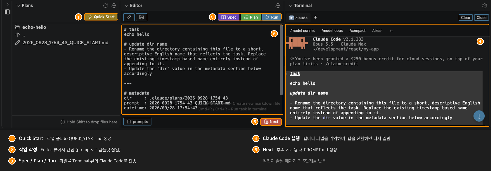

# AI Coding Panel for Claude Code

[](https://marketplace.visualstudio.com/items?itemName=nacn.ai-coding-sidebar) [](https://code.visualstudio.com/) [](https://marketplace.visualstudio.com/items?itemName=nacn.ai-coding-sidebar)

[English](README.md) | [日本語](README-JA.md) | 한국어 | [简体中文](README-ZH-CN.md) | [繁體中文](README-ZH-TW.md) | [Português (BR)](README-PT-BR.md)

Claude Code의 생산성을 극대화하도록 설계된 강력한 VS Code 패널 확장 프로그램입니다.

프롬프트 파일 관리, AI 명령 실행, 결과 확인을 하나의 통합 패널 안에서 모두 처리하여 Claude Code 워크플로를 간소화합니다. 더 이상 파일 탐색기, 에디터, 터미널 사이를 오가며 컨텍스트를 전환할 필요가 없습니다.



## Claude Code에 이 확장 프로그램이 필요한 이유

이 확장 프로그램은 Claude Code 사용 경험을 향상시키기 위해 만들어졌습니다.

- **매끄러운 터미널 통합**: 프로세스 기반 모니터링으로 Claude Code 세션을 자동 감지합니다(프롬프트 패턴에 의존하지 않음)
- **스마트한 컨텍스트 관리**: 탭을 전환하면 Terminal, Editor, Plans 뷰 간에 파일 컨텍스트가 자동으로 동기화됩니다
- **지능형 명령 단축 버튼**: Claude Code가 실행 중인지 대기 중인지에 따라 버튼이 자동으로 바뀝니다
- **동적 탭 이름**: iTerm2처럼 실행 중인 프로세스를 명령 종류 아이콘(▶️ Run, 📝 Plan, 📑 Spec)과 함께 표시합니다
- **세션 유지**: 뷰를 전환해도 터미널 세션이 유지되므로 컨텍스트나 기록이 사라지지 않습니다

## 기능

| 기능 | 설명 |
| --- | --- |
| **Plans** | 디렉터리 탐색이 가능한 플랫 리스트 뷰에서 프롬프트 파일을 탐색하고 관리 |
| **Editor** | Run/Plan/Spec 버튼으로 Claude Code를 실행하는 커맨드 센터 |
| **Terminal** | 자동 감지, 상황별 단축 버튼, 세션 유지 기능을 갖춘 Claude Code 최적화 터미널 |
| **Menu** | 설정, 문서, 템플릿 커스터마이즈(워크스페이스별 또는 글로벌)에 빠르게 접근 |

## 기능 상세

### Plans

디렉터리 탐색이 가능한 플랫 리스트 뷰에서 파일을 탐색하고 관리합니다.

| 기능 | 설명 |
| --- | --- |
| 플랫 리스트 표시 | 현재 디렉터리의 내용만 표시합니다(트리 구조 아님) |
| 디렉터리 탐색 | 디렉터리를 클릭하면 해당 디렉터리로 이동합니다. ".."을 사용하면 상위 디렉터리로 돌아갑니다 |
| 파일 자동 선택 | 하위 디렉터리로 이동하면 가장 오래된 TASK.md, PROMPT.md, SPEC.md 또는 QUICK_START.md 파일을 자동으로 선택해 표시합니다. 루트 디렉터리로 돌아가면 아무것도 선택하지 않으므로 루트는 단순한 작업 목록으로 유지됩니다 |
| **프롬프트 포함 디렉터리 생성** | "Create directory" 버튼을 누르면 `.claude/plans`와 Run/Plan/Spec 버튼 사용법 안내가 담긴 초기 프롬프트 파일(`YYYY_MMDD_HHMM_SS_PROMPT.md`)이 자동으로 생성됩니다. 파일은 Editor 뷰에서 자동으로 열립니다 |
| **Quick Start** | 뷰 상단의 ⚡ Quick Start 버튼을 누르면 폴더 이름을 묻지 않고 타임스탬프 이름의 디렉터리(`YYYY_MMDD_HHMM_SS`)와 `QUICK_START.md` 파일을 생성합니다. 바로 작업 내용을 작성하고 싶을 때 사용하세요 |
| 경로 표시 | 현재 경로가 목록의 첫 번째 항목으로 표시되며, 인라인 액션 버튼(New PROMPT.md, New TASK.md, New SPEC.md, Copy, Rename, New Directory, Archive)이 함께 제공됩니다 |
| **날짜/시간 접두어** | 루트 디렉터리에서는 디렉터리 이름 앞에 날짜 또는 시간을 표시합니다. 오늘이면 `[HH:MM]`, 그 외 날짜는 `[MM/DD]`입니다(파일에는 접두어가 붙지 않음) |
| **Editor 대상 파일 아이콘** | Editor 뷰에서 열리는 파일(TASK.md, PROMPT.md, SPEC.md, QUICK_START.md)은 일반 Markdown 파일과 구분되도록 `edit` 아이콘으로 표시됩니다 |
| 정렬 | 기본적으로 파일은 생성일 기준 오름차순으로 정렬됩니다 |
| 드래그 앤 드롭 | 뷰 안에서 또는 외부에서 파일을 드래그하여 복사합니다. 뷰 외부에서 드래그해 올 때는 **Shift** 키를 누른 상태로 드래그하세요. VS Code는 Shift 키를 누르지 않으면 드래그 중에 webview 기반 뷰의 포인터 이벤트를 비활성화합니다. 디렉터리 행에 드롭하면 해당 디렉터리로, 뷰의 다른 곳에 드롭하면 현재 표시 중인 디렉터리로 복사됩니다. 폴더는 드롭할 수 없습니다(파일만 가능). 뷰 오른쪽 아래에 안내 문구가 표시됩니다 |
| **인라인 액션 툴팁** | 행의 인라인 액션 아이콘(Archive, New PROMPT.md, Rename..., Insert Path to Editor 등)에 마우스를 올리면 액션 이름이 표시됩니다 |
| **키보드 탐색** | ↑ / ↓ 키로 선택을 이동하고 Enter 키로 선택한 항목을 엽니다 |
| 자동 새로고침 | 파일이 생성, 수정, 삭제되면 자동으로 갱신됩니다(뷰가 숨겨져 있어도 동작) |
| 설정 아이콘 | 기본 경로와 정렬 설정에 빠르게 접근합니다 |

### Editor (Claude Code 커맨드 센터)

패널에서 바로 Markdown 프롬프트 파일을 편집하고 Claude Code 명령을 실행합니다.

| 기능 | 설명 |
| --- | --- |
| **Run/Plan/Spec 명령** | 미리 구성된 명령으로 Claude Code를 실행합니다:<br>- **Run** (`Cmd+R` / `Ctrl+R`): `claude "Execute the instructions described in the file at ${filePath}"`<br>- **Plan**: `claude --permission-mode plan "Review ... create an implementation plan ..."`<br>- **Spec**: `claude --permission-mode plan "Review ... create specification documents ..."`<br>실행 전에 자동으로 저장하며, 파일을 열지 않은 상태에서도 동작합니다 |
| **전송 기록** | Spec / Plan / Run을 누르면 열려 있는 파일 끝의 `## sent history` 섹션에 전송 일시가 추가됩니다(예: `- run : 2026/09/06 21:27:29`). 이후 전송 시에도 같은 섹션이 재사용되며, `editor.recordSendTimestamp`로 기록을 끌 수 있습니다 |
| **Resume 명령** | Spec / Plan / Run을 실행할 때마다 생성된 세션 ID로 Claude Code를 시작하고, 해당 명령을 타임스탬프 옆에 기록합니다(예: `- run : 2026/09/06 21:27:29 \| claude --resume 0f1d2c3b-...`). 나중에 세션을 다시 열 수 있습니다. `editor.recordResumeCommand`로 끌 수 있습니다 |
| **터미널 자동 연동** | 명령은 Terminal 뷰로 전송되며, 파일과 탭이 자동으로 연결되어 매끄러운 워크플로를 제공합니다 |
| 자동 표시 | 타임스탬프 이름의 Markdown 파일(형식: `YYYY_MMDD_HHMM_SS_PROMPT.md`, `..._TASK.md`, `..._SPEC.md`, `..._QUICK_START.md`)을 선택하면 자동으로 열립니다. 그 외 Markdown 파일은 표준 에디터에서 열립니다 |
| **2단 레이아웃** | 뷰는 두 개의 바로 나뉩니다. 상단 바에는 왼쪽에 Edit / Save, 오른쪽에 Spec / Plan / Run이 있고, 하단 바에는 왼쪽에 prompts 버튼, 오른쪽에 Next 버튼이 있습니다 |
| Save 버튼 | 상단 바에 표시되며, 저장되지 않은 변경 사항이 있으면 색이 바뀝니다. 열린 파일이 없으면 새 파일을 생성합니다(현재 Plans 디렉터리에 저장) |
| **Next 버튼** | 뷰 하단의 전용 바에 있는 빨간색 **Next** 버튼입니다. 타임스탬프가 붙은 새 `PROMPT.md`를 생성해 열고, 텍스트 영역에 캐럿을 두어 바로 입력을 시작할 수 있게 합니다. `Cmd+M` / `Ctrl+M`으로도 사용할 수 있습니다 |
| **prompts 버튼** | 하단 바 왼쪽 끝에 있는 **prompts** 버튼입니다. 클릭하면 버튼 바로 위에 템플릿 메뉴가 열리고, 선택한 템플릿이 캐럿 위치에 삽입됩니다(버튼을 다시 누르거나, 다른 곳을 클릭하거나, `Escape`를 누르면 메뉴가 닫힙니다). 메뉴 헤더의 **+** 버튼으로 새 템플릿을 만들 수 있습니다. 생성 위치(Workspace 또는 Global)를 선택하고 이름을 입력하면 해당 디렉터리에 파일이 생성되어 VS Code 에디터에서 열립니다. 템플릿은 워크스페이스용은 `.vscode/ai-coding-panel/prompts/*.md`에, 모든 워크스페이스 공통용은 `<globalTemplatesPath>/prompts/*.md`에 둡니다(템플릿당 파일 하나). 두 곳의 템플릿이 함께 나열되며 글로벌 템플릿에는 `(global)` 표시가 붙습니다. 양쪽에 같은 파일 이름이 있으면 워크스페이스 쪽이 사용됩니다. 어느 쪽에도 Markdown 파일이 없으면 확장 프로그램에 번들된 템플릿이 사용됩니다. `editor.disableWorkspacePromptTemplates` 또는 `editor.disableGlobalPromptTemplates`로 각 소스를 목록에서 제외할 수 있습니다. 파일 내용은 그대로 삽입되므로 맨 앞의 `# heading`도 함께 삽입됩니다. 제목은 메뉴에 표시되는 이름으로만 사용됩니다. `{{filename}}`, `{{filepath}}`, `{{dirpath}}`, `{{datetime}}`, `{{timestamp}}`는 열려 있는 파일의 값으로 치환됩니다. 명령 팔레트의 **Insert Prompt Template**에서도 같은 동작을 사용할 수 있으며, 이 경우 퀵 픽이 대신 표시됩니다. Menu 뷰의 Workspace 섹션에서 **Customize Prompt Templates**를 실행하면 번들 템플릿이 워크스페이스로 복사되고, Global 섹션의 같은 이름 항목을 실행하면 글로벌 디렉터리로 복사됩니다 |
| 버튼 아이콘 | 모든 버튼은 VS Code codicon을 사용하며(Spec: 책, Plan: 체크리스트, Run: 재생, Next: 새 파일, Edit: 연필, Save: 플로피 디스크, prompts: 스니펫), Plans View의 Quick Start 버튼과 디자인이 통일되어 있습니다 |
| 명령 커스터마이즈 | 설정에서 Run, Plan, Spec 명령을 워크플로에 맞게 구성할 수 있습니다 |
| **클릭 가능한 URL** | 텍스트 안의 URL에는 밑줄이 표시되며, 클릭하면 기본 브라우저에서 열립니다. URL을 마우스 오른쪽 버튼으로 클릭하면 **Open in Default Browser** 또는 **Open in Integrated Browser**(VS Code의 Simple Browser)를 선택할 수 있습니다. 그 외 위치를 마우스 오른쪽 버튼으로 클릭하면 VS Code 표준 메뉴가 표시됩니다 |
| 읽기 전용 모드 | 파일이 VSCode 에디터에서 활성화되어 있으면 자동으로 읽기 전용 모드로 전환됩니다 |
| 자동 저장 | 파일 전환, 디렉터리 이동, 뷰를 닫을 때 자동으로 저장합니다 |
| 편집 복원 | 다른 확장 프로그램에서 돌아오면 편집 중이던 파일을 복원합니다 |
| 설정 아이콘 | 명령 설정에 빠르게 접근합니다 |
| 포커스 표시 | 뷰에 포커스가 있으면 테두리를 표시합니다 |

### Terminal (Claude Code 최적화)

내장 터미널은 지능형 자동화와 컨텍스트 인식 기능을 갖춘 Claude Code 전용 터미널입니다.

| 기능 | 설명 |
| --- | --- |
| **Claude Code 자동 감지** | 프로세스 기반 감지(1.5초마다 확인)로 프롬프트 변경과 관계없이 Claude Code 세션을 안정적으로 식별합니다. Claude Code가 시작/종료되면 UI와 단축 버튼이 자동으로 전환됩니다 |
| **상황별 단축 버튼** | 상태에 따라 바뀌는 스마트 버튼:<br>- 미실행 시: `claude`, `claude -c`, `claude -r`, `claude --from-pr`(입력만 하고 실행하지 않음), `↑`<br>- `↑` 누른 후(업데이트 명령): `claude update`, `←`<br>- 실행 중: `/model sonnet`, `/model opus`, `/compact`, `/clear`, `←`<br>Claude Code 세션 중에 모델 전환과 업데이트 명령을 빠르게 실행할 수 있습니다 |
| **Run 단축키** | Terminal 뷰에 포커스가 있을 때 `Cmd+R` / `Ctrl+R`을 누르면 Editor 뷰의 Run 명령이 실행됩니다. 저장되지 않은 에디터 변경 사항은 먼저 저장되며, 키 입력은 셸로 전달되지 않습니다 |
| **명령 종류 아이콘** | 탭 이름에 명령의 출처를 나타내는 아이콘이 표시됩니다:<br>▶️ Run 버튼<br>📝 Plan 버튼<br>📑 Spec 버튼 |
| **동적 프로세스 이름** | iTerm2처럼 탭 이름이 현재 실행 중인 프로세스를 표시하도록 자동으로 갱신됩니다 |
| **탭-파일 연결** | Editor 뷰에서 보낸 명령은 해당 파일을 터미널 탭에 연결합니다. 탭을 전환하면 자동으로:<br>- 연결된 파일을 Editor 뷰에서 엽니다<br>- Plans 뷰에서 파일이 있는 디렉터리로 이동합니다<br>- 작업 디렉터리 이름이 변경된 경우에도 추적합니다 |
| **세션 유지** | 뷰를 전환하거나 확장 프로그램이 바뀌어도 터미널 세션과 출력 기록이 유지되므로 작업 내용을 잃지 않습니다 |
| 다중 탭 | 최대 5개의 독립적인 터미널 탭을 만들 수 있습니다. "+" 버튼을 클릭해 새 탭을 추가하고, 탭을 클릭해 전환합니다. 닫기 버튼(× Close)은 단축 버튼 영역의 오른쪽 끝에 있습니다 |
| 자동 스크롤 | 새 출력이 들어오거나 뷰 크기가 바뀔 때 스크롤 위치를 맨 아래로 유지합니다(이미 맨 아래에 있는 경우에만) |
| 클릭 가능한 링크 | URL은 브라우저에서 열리고, 파일 경로(예: `./src/file.ts:123`)는 해당 줄로 이동하여 에디터에서 열립니다. 줄바꿈으로 두 줄에 걸친 URL은 합쳐서 엽니다 |
| URL 컨텍스트 메뉴 | URL을 마우스 오른쪽 버튼으로 클릭하면 **Open in Default Browser** 또는 **Open in Integrated Browser**(VS Code의 Simple Browser)를 선택할 수 있습니다. 왼쪽 클릭은 기존과 같이 기본 브라우저에서 엽니다 |
| 유니코드 지원 | 올바른 문자 폭 계산으로 CJK 문자를 완벽하게 지원합니다 |
| 설정 가능 | 셸 경로, 글꼴 크기, 글꼴 패밀리, 커서 스타일, 커서 깜빡임, 스크롤백 줄 수를 커스터마이즈할 수 있습니다 |
| WebView 헤더 | 셸 이름이 표시되는 탭 바, 단축 버튼, 활성 탭용 Clear 및 Kill 버튼 |
| 설정 아이콘 | 타이틀 바에서 터미널 설정에 빠르게 접근합니다 |
| 기본 표시 상태 | 접힘(필요할 때 펼침) |
| 포커스 표시 | 뷰에 포커스가 있으면 테두리를 표시합니다 |

### Menu

설정과 문서에 빠르게 접근합니다.

| 기능 | 설명 |
| --- | --- |
| 설정 | 사용자 설정 또는 글로벌 설정을 엽니다 |
| 템플릿 | 워크스페이스별 또는 모든 워크스페이스 공통(글로벌)으로 템플릿을 커스터마이즈합니다 |
| 섹션 | Global과 Workspace는 기본적으로 펼쳐져 있어 뷰를 열면 바로 항목이 보입니다. Usage Guide는 접힌 상태로 시작합니다 |

## 일반적인 Claude Code 워크플로

### 1. 작업 생성
1. Plans 뷰 상단의 ⚡ Quick Start 버튼을 클릭해 새 작업 디렉터리를 만듭니다
2. 타임스탬프가 붙은 QUICK_START.md 파일이 Editor 뷰에서 열립니다
3. 작업 내용이나 요구 사항을 작성합니다

### 2. Claude Code로 실행
1. `Cmd+R` / `Ctrl+R`을 눌러 Claude Code로 작업을 실행합니다
2. Terminal 뷰가 자동으로 활성화되고 명령이 전송됩니다
3. Claude Code가 요청 처리를 시작합니다

### 3. 진행 상황 모니터링
1. Terminal 뷰에서 Claude Code의 출력을 확인합니다
2. 탭 이름에 아이콘(▶️, 📝, 📑)과 함께 프로세스 상태가 표시됩니다
3. 뷰를 전환해도 스크롤 위치가 유지됩니다

### 4. 결과 검토
1. Claude Code가 구현 계획이나 사양 문서를 생성합니다
2. 파일이 Plans 뷰에 자동으로 나타납니다
3. 파일을 클릭해 Editor 뷰에서 검토합니다
4. 터미널 탭은 작업 파일과의 연결을 유지합니다

### 5. 반복
1. 터미널 탭을 전환하며 여러 작업을 진행합니다
2. 각 탭은 연결된 파일과 컨텍스트를 기억합니다
3. 탭을 전환하면 Plans/Editor 뷰가 자동으로 동기화됩니다

## 사용법

### 키보드 단축키

| 단축키 | 동작 |
| --- | --- |
| `Cmd+Shift+A` (macOS)<br>`Ctrl+Shift+A` (Windows/Linux) | AI Coding Panel에 포커스 |
| `Cmd+S` (macOS)<br>`Ctrl+S` (Windows/Linux) | 새 작업(패널에 포커스가 있을 때) |
| `Cmd+M` (macOS)<br>`Ctrl+M` (Windows/Linux) | 새 Markdown 파일 생성(패널에 포커스가 있을 때) |
| `Cmd+R` (macOS)<br>`Ctrl+R` (Windows/Linux) | Editor에서 작업 실행(자동 저장 후 터미널로 명령 전송). Terminal 뷰에 포커스가 있을 때도 사용 가능 |

### 기본 조작
1. 액티비티 바에서 "AI Coding Panel" 아이콘을 클릭합니다(또는 `Cmd+Shift+A` / `Ctrl+Shift+A`를 누릅니다).
2. Plans 상단의 ⚡ Quick Start 버튼을 클릭해 QUICK_START.md 파일이 포함된 새 작업 디렉터리를 만듭니다.
3. Editor 뷰에서 작업 내용이나 요구 사항을 작성합니다.
4. `Cmd+R` / `Ctrl+R`을 눌러 Claude Code로 작업을 실행합니다.
5. Terminal 뷰에서 Claude Code의 진행 상황을 확인합니다.
6. Claude Code가 파일을 생성하면 Plans 뷰와 Editor 뷰에서 결과를 검토합니다.

## 템플릿 기능

Plans에서 파일을 생성할 때 템플릿으로 내용을 자동으로 채울 수 있습니다. AI 코딩에 사용하는 Markdown 파일의 형식을 일관되게 유지하고 시간을 절약할 수 있습니다.

### 템플릿 설정
1. Plans 창의 톱니바퀴 아이콘을 클릭합니다.
2. "Workspace Settings" -> "Customize template"을 선택합니다.
3. `.vscode/ai-coding-panel/templates/`에 템플릿 파일이 생성됩니다:
   - `task.md` - Start Task용 템플릿
   - `spec.md` - New Spec용 템플릿
   - `prompt.md` - New File(PROMPT.md)용 템플릿
   - `quick_start.md` - Quick Start용 템플릿
4. 템플릿을 편집하고 저장합니다.

### 기본 템플릿
각 템플릿은 공통 `metadata` 섹션으로 끝납니다:

```markdown
# task


---

# metadata
dir     : {{dirpath}}
prompt  : {{filename}}
datetime: {{datetime}}
```

### 사용 가능한 변수
템플릿 안에서 다음 변수를 사용할 수 있습니다:

- `{{datetime}}`: 생성 일시(예: 2026/09/06 21:46:07)
- `{{filename}}`: 확장자를 포함한 파일 이름(예: 2025_1229_1430_25_PROMPT.md)
- `{{timestamp}}`: 타임스탬프(예: 2025_1229_1430_25)
- `{{filepath}}`: 워크스페이스 루트 기준 파일 경로(예: .claude/plans/2025_1229_1430_25_PROMPT.md)
- `{{dirpath}}`: 워크스페이스 루트 기준 디렉터리 경로(예: .claude/plans)

### 글로벌 템플릿
템플릿은 모든 워크스페이스에서 공유할 수도 있습니다. Menu 뷰의 Global 섹션에서 **Customize Editor Templates**를 실행하면 글로벌 디렉터리에 같은 4개의 파일이 생성되며, 그곳에서 편집하면 됩니다. 워크스페이스 밖의 경로는 현재 창의 VS Code 탐색기에 표시할 수 없기 때문에, 글로벌 디렉터리는 새 VS Code 창에서 열립니다. 창은 루트에서 열리므로 `templates`와 `prompts`를 모두 다룰 수 있습니다.

글로벌 디렉터리는 이 확장 프로그램의 글로벌 스토리지 디렉터리입니다. dotfiles 저장소 등 다른 위치에 두려면 **User** 설정에서 `aiCodingSidebar.globalTemplatesPath`를 지정하세요. 이 디렉터리에는 파일 템플릿용 `templates` 하위 디렉터리와 프롬프트 템플릿용 `prompts` 하위 디렉터리가 있어야 합니다:

```
<globalTemplatesPath>
|-- templates/   task.md, spec.md, prompt.md, quick_start.md
`-- prompts/     prompt templates inserted from the Editor view
```

### 번들 프롬프트 템플릿
이 확장 프로그램은 Editor 뷰의 **prompts** 버튼용으로 다음 스니펫을 번들로 제공합니다:

| 파일 | 요청 내용 |
|---|---|
| `add_test.md` | 정상 경로, 경곗값, 오류 처리를 다루는 테스트 |
| `output_status.md` | 현재 상태를 `dir`의 디렉터리 아래에 타임스탬프가 붙은 Markdown 파일로 작성 |
| `refactor.md` | 동작을 변경하지 않는 리팩터링 |
| `review.md` | 버그와 누락된 오류 처리를 우선적으로 보고하는 리뷰 |

이 스니펫은 워크스페이스와 글로벌 디렉터리 어디에도 Markdown 파일이 없을 때만 목록에 표시됩니다. Workspace 섹션의 **Customize Prompt Templates**와 Global 섹션의 같은 이름 항목은 스니펫을 복사하되 기존 파일은 덮어쓰지 않습니다. 따라서 업데이트 후 번들에 추가된 스니펫을 받으려면 둘 중 하나를 다시 실행하세요.

### 템플릿 우선순위
1. `.vscode/ai-coding-panel/templates/`의 워크스페이스 템플릿(있는 경우)
2. `<globalTemplatesPath>/templates/`의 글로벌 템플릿(있는 경우)
3. 확장 프로그램 내장 템플릿

1단계와 2단계는 `editor.disableWorkspaceEditorTemplates`와 `editor.disableGlobalEditorTemplates`로 각각 끌 수 있으며, 그러면 다음 단계가 대신 사용됩니다. 3단계는 항상 유지되므로 파일 생성이 실패하지 않습니다. 프롬프트 템플릿도 `editor.disableWorkspacePromptTemplates`와 `editor.disableGlobalPromptTemplates`로 동일하게 동작하며, 둘 다 끄면 번들 스니펫이 나열됩니다. 이 설정은 읽기 동작에만 영향을 줍니다. **Customize Editor Templates**, **Customize Prompt Templates**, **+** 버튼은 여전히 선택한 디렉터리에 파일을 생성합니다.

### 템플릿 활용 예
- `overview` 섹션에 AI 어시스턴트용 프롬프트를 기록합니다.
- `tasks` 섹션에서 할 일을 관리합니다.
- 프로젝트별 섹션을 추가합니다.

## 파일 작업

| 기능 | 설명 |
| --- | --- |
| 파일 또는 폴더 생성 | 새 파일과 폴더를 빠르게 만듭니다. |
| 이름 변경 | 파일과 폴더의 이름을 변경합니다. 디렉터리 이름을 변경하면 변경된 디렉터리로 자동 이동합니다. |
| 삭제 | 파일과 폴더를 삭제합니다(휴지통으로 이동). |
| 복사 / 잘라내기 / 붙여넣기 | 표준 클립보드 작업을 수행합니다. |
| 드래그 앤 드롭 | Plans 뷰 안에서 또는 외부에서 파일을 드래그하여 복사합니다. 뷰 외부에서 드래그해 올 때는 **Shift** 키를 누른 상태로 드래그하세요. VS Code는 Shift 키를 누르지 않으면 드래그 중에 webview 기반 뷰의 포인터 이벤트를 비활성화합니다. 디렉터리 행에 드롭하면 해당 디렉터리로, 뷰의 다른 곳에 드롭하면 현재 표시 중인 디렉터리로 복사됩니다. 복사 후 성공 메시지를 표시합니다. |
| Archive | 작업 디렉터리와 개별 파일을 보관하여 워크스페이스를 정리합니다. 디렉터리나 파일 행의 보관 아이콘(인라인 버튼)을 클릭하거나, 마우스 오른쪽 버튼으로 클릭해 "Archive"를 선택하면 `archived` 폴더로 이동합니다. 루트가 아닌 디렉터리 안에서는 경로 표시 헤더에도 보관 버튼이 나타나며, 클릭하면 현재 디렉터리를 보관하고 루트로 돌아갑니다. Editor 뷰에서 열려 있는 파일을 보관하면 에디터가 비워집니다. 같은 이름의 항목이 이미 있으면 충돌을 피하기 위해 타임스탬프가 자동으로 추가됩니다(디렉터리는 이름 끝에, 파일은 확장자 앞에 삽입). |
| Checkout Branch | 디렉터리를 마우스 오른쪽 버튼으로 클릭하면 디렉터리 이름으로 git 브랜치를 체크아웃합니다. 브랜치가 없으면 생성하고, 이미 있으면 해당 브랜치로 전환합니다. |
| Insert Path to Editor | Editor 뷰에 상대 경로를 삽입합니다. 파일 행의 편집 아이콘을 클릭하거나, 마우스 오른쪽 버튼으로 클릭해 "Insert Path to Editor"를 선택합니다. 다중 선택을 지원합니다. |
| Insert Path to Terminal | Terminal 뷰에 상대 경로를 삽입합니다. 파일 행의 터미널 아이콘을 클릭하거나, 마우스 오른쪽 버튼으로 클릭해 "Insert Path to Terminal"을 선택합니다. 다중 선택을 지원하며, 경로는 공백으로 구분됩니다. |

## 기타 기능

### 파일 및 폴더 생성

| 항목 | 절차 |
| --- | --- |
| Quick Start | Plans View 상단의 ⚡ Quick Start 버튼을 클릭합니다.<br>폴더 이름을 묻지 않고 타임스탬프 이름의 디렉터리(`YYYY_MMDD_HHMM_SS`)를 만들고, 그 안에 `QUICK_START.md` 파일을 생성합니다.<br>파일은 Editor View에서 열리고 Plans에서 선택됩니다. 같은 이름의 디렉터리가 이미 있으면 숫자 접미사(`_2`, `_3`, ...)가 붙습니다.<br>Plans 디렉터리가 아직 없는 경우(뷰에 `Create directory: ...`가 표시되는 경우)에는 `Create directory`를 클릭했을 때와 똑같이 먼저 디렉터리를 만든 뒤, 그 안에 Quick Start 디렉터리를 생성합니다. |
| New Task | 패널에 포커스가 있을 때 `Cmd+S` / `Ctrl+S`를 누릅니다.<br>Plans View에서 현재 열려 있는 디렉터리 아래에 새 디렉터리를 만들고, 타임스탬프가 붙은 Markdown 파일을 자동으로 생성합니다.<br>파일은 Plans에서 "editing" 라벨과 함께 선택되고 Editor View에서 열립니다.<br>현재 경로를 가져올 수 없으면 기본 경로를 사용합니다. |
| New Directory | 경로 표시 행의 폴더 아이콘을 클릭합니다.<br>현재 열려 있는 디렉터리 아래에 새 디렉터리를 만듭니다(Markdown 파일은 생성하지 않음). |
| PROMPT.md 생성 | Editor View의 **Next** 버튼, 경로 표시 행의 파일 아이콘을 클릭하거나 `Cmd+M` / `Ctrl+M`을 누릅니다.<br>타임스탬프가 붙은 Markdown 파일(예: `2025_1229_1430_25_PROMPT.md`)이 생성되고, 파일 맨 앞에 캐럿이 놓인 상태로 Editor View에서 열립니다. |
| TASK.md 생성 | 경로 표시 행의 TASK.md 아이콘을 클릭합니다.<br>타임스탬프가 붙은 TASK.md 파일이 생성되어 Editor View에서 열립니다. |
| SPEC.md 생성 | 경로 표시 행의 SPEC.md 아이콘을 클릭합니다.<br>타임스탬프가 붙은 SPEC.md 파일이 생성되어 Editor View에서 열립니다. |

### 기본 상대 경로 설정

| 방법 | 절차 |
| --- | --- |
| Plans 설정(권장) | 1. Plans의 톱니바퀴 아이콘을 클릭합니다.<br>2. `aiCodingSidebar.plans.defaultRelativePath`로 필터링된 설정 화면이 열립니다.<br>3. 기본 상대 경로를 편집합니다(예: `src`, `.claude/plans`, `docs/api`). |
| 워크스페이스 설정 | 1. Plans의 톱니바퀴 아이콘을 클릭합니다.<br>2. "Workspace Settings"를 선택합니다.<br>3. 다음 중 하나를 선택합니다:<br>&nbsp;&nbsp;- **Create/Edit settings.json**: 워크스페이스 설정 파일을 생성하거나 편집합니다.<br>&nbsp;&nbsp;- **Configure .claude folder**: `.claude/plans` 폴더를 만들고 설정을 적용합니다.<br>&nbsp;&nbsp;- **Customize template**: 파일 생성 시 사용할 템플릿을 편집합니다. |
| 확장 프로그램에서 직접 입력 | 1. Plans의 편집 아이콘을 클릭합니다.<br>2. 상대 경로를 입력합니다(예: `src`, `.claude/plans`, `docs/api`).<br>3. 설정에 저장할지 선택합니다. |

#### 상대 경로 예
- `src` -> `<project>/src`
- `docs/api` -> `<project>/docs/api`
- `.claude/plans` -> `<project>/.claude/plans`
- 빈 문자열 -> 워크스페이스 루트

#### 설정한 경로가 존재하지 않는 경우
기본 상대 경로가 존재하지 않으면 Plans에 "Create directory" 버튼이 표시됩니다. 클릭하면 디렉터리가 자동으로 생성되고 그 내용이 표시됩니다.

### 기타

| 기능 | 설명 |
| --- | --- |
| 상대 경로 복사 | 워크스페이스 기준 상대 경로를 클립보드에 복사합니다. |
| Plans 설정 | Plans에서 설정 화면을 열어 기본 상대 경로를 바로 편집합니다. |
| 검색 | 워크스페이스 전체에서 파일을 검색합니다. |

## 설정

| 설정 | 설명 | 타입 | 기본값 | 옵션 / 예시 |
| --- | --- | --- | --- | --- |
| `plans.defaultRelativePath` | Plans의 기본 상대 경로 | string | `".claude/plans"` | `"src"`, `.claude/plans`, `"docs/api"` |
| `plans.sortBy` | Plans의 파일과 디렉터리 정렬 기준 | string | `"created"` | `"name"`(파일 이름)<br>`"created"`(생성일)<br>`"modified"`(수정일) |
| `plans.sortOrder` | Plans의 파일과 디렉터리 정렬 순서 | string | `"ascending"` | `"ascending"`(오름차순)<br>`"descending"`(내림차순) |
| `editor.commandPrefix` | 아래 명령 템플릿의 `${commandPrefix}`에 치환되는 명령 접두어 | string | `"claude"` | `"claude"`, `"claude --permission-mode auto"`, `"claude --model opus"` |
| `editor.runCommand` | Editor 뷰에서 Run 버튼을 클릭했을 때 실행할 명령 템플릿 | string | `claude "${editorContent}"` | 에디터 내용의 플레이스홀더로 `${editorContent}`, 파일 경로의 플레이스홀더로 `${filePath}`를 사용합니다. 값이 하나의 인수로 전달되도록 플레이스홀더를 큰따옴표로 감싸세요. |
| `editor.runCommandWithoutFile` | 파일을 열지 않은 상태에서 Run 버튼을 클릭했을 때 실행할 명령 템플릿 | string | `claude "${editorContent}"` | 에디터 내용의 플레이스홀더로 `${editorContent}`를 사용합니다. 값이 하나의 인수로 전달되도록 플레이스홀더를 큰따옴표로 감싸세요. |
| `editor.runPlanCommand` | Plan 버튼을 클릭했을 때 실행할 명령 템플릿 | string | `claude --permission-mode plan "Review the file at ${filePath} and create an implementation plan. Save it as a timestamped file (format: YYYY_MMDD_HHMM_SS_plan.md) in the same directory as ${filePath}."` | 파일 경로의 플레이스홀더로 `${filePath}`를 사용합니다. 값이 하나의 인수로 전달되도록 플레이스홀더를 큰따옴표로 감싸세요. |
| `editor.runSpecCommand` | Spec 버튼을 클릭했을 때 실행할 명령 템플릿 | string | `claude --permission-mode plan "Review the file at ${filePath} and create specification documents. Save them as timestamped files (format: YYYY_MMDD_HHMM_SS_requirements.md, YYYY_MMDD_HHMM_SS_design.md, YYYY_MMDD_HHMM_SS_plans.md) in the same directory as ${filePath}."` | 파일 경로의 플레이스홀더로 `${filePath}`를 사용합니다. 값이 하나의 인수로 전달되도록 플레이스홀더를 큰따옴표로 감싸세요. |
| `editor.recordSendTimestamp` | Spec / Plan / Run을 누르면 열려 있는 파일에 전송 일시를 추가 | boolean | `true` | 기록은 파일 끝의 `## sent history` 섹션에 추가됩니다 |
| `editor.recordResumeCommand` | 생성된 세션 ID로 Spec / Plan / Run을 시작하고, 해당 `claude --resume <session-id>` 명령을 기록 | boolean | `true` | `editor.recordSendTimestamp`가 필요합니다. Claude Code가 이미 실행 중일 때, 그리고 `editor.commandPrefix`가 `claude`가 아니거나 이미 세션을 지정하고 있을 때는 건너뜁니다 |
| `editor.promptTemplatesPath` | Editor 뷰에서 삽입하는 프롬프트 템플릿을 보관하는 디렉터리(워크스페이스 루트 기준) | string | `".vscode/ai-coding-panel/prompts"` | 바로 아래의 각 `.md` 파일이 하나의 템플릿이 됩니다. Markdown 파일이 없으면 확장 프로그램에 번들된 템플릿이 사용됩니다 |
| `editor.disableWorkspaceEditorTemplates` | 워크스페이스의 파일 템플릿을 읽지 않음 | boolean | `false` | 대신 글로벌 템플릿, 그다음 번들 템플릿이 사용됩니다 |
| `editor.disableGlobalEditorTemplates` | 글로벌 디렉터리의 파일 템플릿을 읽지 않음 | boolean | `false` | 번들 템플릿은 항상 마지막 대체 수단으로 유지되므로 파일 생성이 실패하지 않습니다 |
| `editor.disableWorkspacePromptTemplates` | 워크스페이스의 프롬프트 템플릿을 목록에 표시하지 않음 | boolean | `false` | 같은 이름의 워크스페이스 템플릿에 가려져 있던 글로벌 템플릿이 표시됩니다 |
| `editor.disableGlobalPromptTemplates` | 글로벌 디렉터리의 프롬프트 템플릿을 목록에 표시하지 않음 | boolean | `false` | 두 소스를 모두 비활성화하면 번들 스니펫이 나열됩니다 |
| `globalTemplatesPath` | 모든 워크스페이스에서 공유하는 템플릿을 보관하는 디렉터리(`templates`와 `prompts` 하위 디렉터리 포함). 비어 있으면 이 확장 프로그램의 글로벌 스토리지 디렉터리를 사용합니다. 상대 경로는 홈 디렉터리 기준으로 해석되며 `~`도 확장됩니다. **User** 설정에서 지정하세요 | string | `""` | `"~/ai-coding-guide/ai-coding-panel"`로 지정하면 템플릿을 dotfiles 저장소에서 관리할 수 있습니다 |
| `browser.defaultUrl` | Menu 뷰의 Open Integrated Browser 액션으로 여는 URL | string | `"about:blank"` | `"about:blank"`는 빈 탭을 엽니다. `"http://localhost:3000"` 같은 URL을 지정하면 항상 해당 URL을 엽니다 |
| `terminal.shell` | Terminal 뷰의 셸 실행 파일 경로 | string | `""` | 비워 두면 시스템 기본 셸을 사용합니다 |
| `terminal.fontSize` | Terminal 뷰의 글꼴 크기 | number | `12` | 임의의 양수 |
| `terminal.fontFamily` | Terminal 뷰의 글꼴 패밀리 | string | `"monospace"` | 유효한 글꼴 패밀리 |
| `terminal.cursorStyle` | Terminal 뷰의 커서 스타일 | string | `"block"` | `"block"`, `"underline"`, `"bar"` |
| `terminal.cursorBlink` | Terminal 뷰에서 커서 깜빡임 활성화 | boolean | `true` | `true` 또는 `false` |
| `terminal.scrollback` | Terminal 뷰의 스크롤백 줄 수 | number | `1000` | 임의의 양수 |

### 설정 예

`.vscode/settings.json`에 다음을 추가합니다:

```json
{
  "aiCodingSidebar.plans.defaultRelativePath": ".claude/plans",
  "aiCodingSidebar.plans.sortBy": "created",
  "aiCodingSidebar.plans.sortOrder": "ascending",
  "aiCodingSidebar.editor.commandPrefix": "claude",
  "aiCodingSidebar.editor.runCommand": "${commandPrefix} \"${editorContent}\"",
  "aiCodingSidebar.editor.runCommandWithoutFile": "${commandPrefix} \"${editorContent}\"",
  "aiCodingSidebar.editor.runPlanCommand": "${commandPrefix} \"Review the file at ${filePath} and create an implementation plan. Save it as a timestamped file (format: YYYY_MMDD_HHMM_SS_plan.md) in the same directory as ${filePath}.\"",
  "aiCodingSidebar.editor.runSpecCommand": "${commandPrefix} \"Review the file at ${filePath} and create specification documents. Save them as timestamped files (format: YYYY_MMDD_HHMM_SS_requirements.md, YYYY_MMDD_HHMM_SS_design.md, YYYY_MMDD_HHMM_SS_tasks.md) in the same directory as ${filePath}.\"",
  "aiCodingSidebar.terminal.fontSize": 12,
  "aiCodingSidebar.terminal.cursorStyle": "block"
}
```

## 개발 및 빌드

```bash
# Install dependencies
npm install

# Compile TypeScript
npm run compile

# Recompile automatically during development
npm run watch
```

## 디버깅

### 준비
1. 의존성 설치: `npm install`
2. TypeScript 컴파일: `npm run compile`

### 디버깅 시작

#### 명령 팔레트에서 시작(권장)
1. `Ctrl+Shift+P`(Windows/Linux) 또는 `Cmd+Shift+P`(Mac)를 눌러 명령 팔레트를 엽니다.
2. "Debug: Start Debugging"을 입력하고 선택합니다.
3. Enter를 눌러 실행합니다.

#### 기타 실행 방법
- **F5**: 즉시 디버깅을 시작합니다.
- **Run and Debug 뷰**: 사이드바에서 Run and Debug 아이콘을 열고 "Run Extension"을 선택한 뒤 녹색 재생 버튼을 클릭합니다.
- **메뉴 바**: "Run" -> "Start Debugging"을 선택합니다.

### 디버깅 중
- 새 VS Code 창(Extension Development Host)이 열립니다.
- 액티비티 바에 "AI Coding Panel" 아이콘이 표시됩니다.
- 중단점을 설정하고, 변수를 확인하고, 코드를 단계별로 실행할 수 있습니다.
- `Ctrl+R` / `Cmd+R`을 눌러 확장 프로그램을 다시 로드합니다.

## 설치

### Claude Code로 빠르게 시작하기

1. [VS Marketplace](https://marketplace.visualstudio.com/items?itemName=nacn.ai-coding-sidebar)에서 이 확장 프로그램을 설치합니다
2. [Claude Code CLI](https://docs.anthropic.com/claude/docs/claude-code)를 설치합니다
3. `Cmd+Shift+A` / `Ctrl+Shift+A`를 눌러 AI Coding Panel을 엽니다
4. Plans 뷰에서 작업을 생성합니다(로켓 아이콘 🚀 클릭)
5. `Cmd+R` / `Ctrl+R`을 눌러 Claude Code를 시작합니다

### 방법 1: 개발 모드(테스트용)
1. 이 저장소를 클론하거나 다운로드합니다.
2. VS Code에서 엽니다.
3. `F5`를 눌러 Extension Development Host 창을 실행합니다.
4. 새 VS Code 인스턴스에서 확장 프로그램을 테스트합니다.

### 방법 2: VSIX 패키지로 설치

#### 권장: GitHub의 최신 릴리스 사용
1. [GitHub Releases 페이지](https://github.com/NaokiIshimura/vscode-panel/releases)에서 최신 VSIX 파일을 다운로드합니다.
2. 명령줄로 설치합니다:
   ```bash
   code --install-extension ai-coding-sidebar-1.2.8.vsix
   ```
3. VS Code를 재시작합니다.

#### 로컬 빌드 사용
```bash
# Install directly from the releases directory
code --install-extension releases/ai-coding-sidebar-1.2.8.vsix
```

#### 직접 패키지 빌드
1. VSCE 도구를 설치합니다:
   ```bash
   npm install -g @vscode/vsce
   ```
2. VSIX 패키지를 생성합니다:
   ```bash
   npm run package
   ```
3. 생성된 VSIX 파일을 설치합니다:
   ```bash
   code --install-extension releases/ai-coding-sidebar-1.2.8.vsix
   ```
4. VS Code를 재시작합니다.

## 자동 빌드 및 릴리스

이 프로젝트는 GitHub Actions를 사용해 확장 프로그램을 빌드하고 릴리스합니다.

### 자동 빌드 동작 방식
- **트리거**: `master` 브랜치로 푸시.
- **빌드 단계**:
  1. TypeScript를 컴파일합니다.
  2. VSIX 패키지를 자동으로 생성합니다.
  3. 패키지를 GitHub Releases에 업로드합니다.
  4. 저장소의 `releases/` 디렉터리를 갱신합니다.

### 버전 관리
릴리스 태그는 `package.json`의 `version` 필드를 기준으로 생성됩니다.

```bash
# Bump versions
npm run version:patch   # 0.0.1 -> 0.0.2
npm run version:minor   # 0.0.1 -> 0.1.0
npm run version:major   # 0.0.1 -> 1.0.0
```

## 제거

### 명령줄에서
```bash
code --uninstall-extension ai-coding-sidebar
```

### VS Code에서
1. 확장 뷰를 엽니다(`Ctrl+Shift+X` / `Cmd+Shift+X`).
2. "AI Coding Panel"을 검색합니다.
3. "Uninstall"을 클릭합니다.

## 요구 사항

- VS Code 1.74.0 이상
- Node.js(개발 시에만)

## 호환성 참고

이 확장 프로그램은 Claude Code에 최적화되어 있지만 Cursor, GitHub Copilot 같은 다른 AI 코딩 어시스턴트와도 함께 사용할 수 있습니다. 다만 일부 기능(Claude Code 자동 감지, 상황별 단축 버튼 등)은 Claude Code 전용으로 설계되어 다른 도구에서는 동작하지 않을 수 있습니다.
