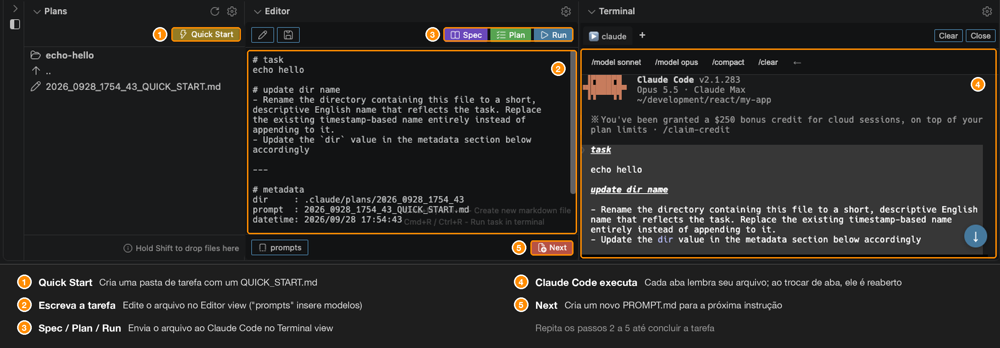

# AI Coding Panel for Claude Code

[](https://marketplace.visualstudio.com/items?itemName=nacn.ai-coding-sidebar) [](https://code.visualstudio.com/) [](https://marketplace.visualstudio.com/items?itemName=nacn.ai-coding-sidebar)

[English](README.md) | [日本語](README-JA.md) | [한국어](README-KO.md) | [简体中文](README-ZH-CN.md) | [繁體中文](README-ZH-TW.md) | Português (BR)

Uma poderosa extensão de painel para o VS Code, criada para maximizar sua produtividade com o Claude Code.

Simplifique seu fluxo de trabalho com o Claude Code gerenciando arquivos de prompt, executando comandos de IA e visualizando resultados — tudo em um único painel integrado. Chega de alternar entre o explorador de arquivos, o editor e o terminal.



## Por que esta extensão para o Claude Code?

Esta extensão foi criada especificamente para aprimorar sua experiência com o Claude Code:

- **Integração transparente com o terminal**: Detecta automaticamente sessões do Claude Code por meio de monitoramento de processos (sem depender de padrões de prompt)
- **Gerenciamento inteligente de contexto**: Sincroniza automaticamente o contexto de arquivos entre as views Terminal, Editor e Plans ao alternar entre abas
- **Atalhos de comando inteligentes**: Botões sensíveis ao contexto que se adaptam conforme o Claude Code está em execução ou ocioso
- **Nomes de aba dinâmicos**: Mostram os processos em execução (como no iTerm2) com ícones do tipo de comando (▶️ Run, 📝 Plan, 📑 Spec)
- **Sessões persistentes**: As sessões do terminal sobrevivem às trocas de view — sem perda de contexto ou histórico

## Recursos

| Recurso | Descrição |
| --- | --- |
| **Plans** | Navegue e gerencie arquivos de prompt em uma lista plana com navegação por diretórios |
| **Editor** | Central de comandos para executar o Claude Code com os botões Run/Plan/Spec |
| **Terminal** | Terminal otimizado para o Claude Code, com detecção automática, atalhos sensíveis ao contexto e sessões persistentes |
| **Menu** | Acesso rápido às configurações, à documentação e à personalização de templates (por workspace ou global) |

## Detalhes dos recursos

### Plans

Navegue e gerencie arquivos em uma lista plana com navegação por diretórios.

| Recurso | Descrição |
| --- | --- |
| Exibição em lista plana | Mostra apenas o conteúdo do diretório atual (não uma estrutura em árvore) |
| Navegação por diretórios | Clique em um diretório para entrar nele. Use ".." para voltar ao diretório pai |
| Seleção automática de arquivo | Seleciona e exibe automaticamente o arquivo TASK.md, PROMPT.md, SPEC.md ou QUICK_START.md mais antigo ao entrar em um subdiretório. Ao voltar ao diretório raiz, nada é selecionado, mantendo a raiz como uma simples lista de tarefas |
| **Criar diretório com prompt** | O botão "Create directory" cria automaticamente `.claude/plans` e um arquivo de prompt inicial (`YYYY_MMDD_HHMM_SS_PROMPT.md`) com orientações úteis sobre o uso dos botões Run/Plan/Spec. O arquivo é aberto automaticamente na Editor view |
| **Quick Start** | O botão ⚡ Quick Start no topo da view cria um diretório nomeado com timestamp (`YYYY_MMDD_HHMM_SS`) e um arquivo `QUICK_START.md` sem pedir um nome de pasta. Use-o quando quiser apenas começar a escrever uma tarefa imediatamente |
| Exibição do caminho | O caminho atual é mostrado como o primeiro item da lista, com botões de ação inline (New PROMPT.md, New TASK.md, New SPEC.md, Copy, Rename, New Directory, Archive) |
| **Prefixo de data/hora** | O diretório raiz exibe a data ou a hora antes dos nomes dos diretórios: `[HH:MM]` para hoje, `[MM/DD]` para outras datas (os arquivos são exibidos sem prefixo) |
| **Ícones dos arquivos do Editor** | Arquivos abertos na Editor view (TASK.md, PROMPT.md, SPEC.md, QUICK_START.md) exibem um ícone `edit` para diferenciá-los de arquivos Markdown comuns |
| Ordenação | Por padrão, os arquivos são ordenados por data de criação (crescente) |
| Arrastar e soltar | Copie arquivos arrastando-os dentro da view ou de fontes externas. Mantenha **Shift** pressionado ao arrastar de fora da view: o VS Code desativa os eventos de ponteiro em views baseadas em webview durante um arrasto, a menos que o Shift esteja pressionado. Solte sobre a linha de um diretório para copiar para esse diretório, ou em qualquer outro ponto da view para copiar para o diretório exibido no momento. Pastas não podem ser soltas (somente arquivos). Um lembrete é exibido no canto inferior direito da view |
| **Tooltips das ações inline** | Passar o mouse sobre um ícone de ação inline em uma linha (Archive, New PROMPT.md, Rename..., Insert Path to Editor etc.) mostra o nome da ação |
| **Navegação por teclado** | Use ↑ / ↓ para mover a seleção e Enter para abrir o item selecionado |
| Atualização automática | Atualiza automaticamente quando arquivos são criados, modificados ou excluídos (mesmo com a view oculta) |
| Ícone de configurações | Acesso rápido à configuração do caminho padrão e da ordenação |

### Editor (Central de comandos do Claude Code)

Edite arquivos de prompt em Markdown e execute comandos do Claude Code diretamente do painel.

| Recurso | Descrição |
| --- | --- |
| **Comandos Run/Plan/Spec** | Execute o Claude Code com comandos pré-configurados:<br>- **Run** (`Cmd+R` / `Ctrl+R`): `claude "Execute the instructions described in the file at ${filePath}"`<br>- **Plan**: `claude --permission-mode plan "Review ... create an implementation plan ..."`<br>- **Spec**: `claude --permission-mode plan "Review ... create specification documents ..."`<br>Salva automaticamente antes da execução e funciona mesmo sem um arquivo aberto |
| **Histórico de envios** | Pressionar Spec / Plan / Run adiciona a data e a hora do envio a uma seção `## sent history` no final do arquivo aberto (por exemplo, `- run : 2026/09/06 21:27:29`). A seção é reaproveitada nos envios seguintes, e o registro pode ser desativado com `editor.recordSendTimestamp` |
| **Comando de retomada** | Cada Spec / Plan / Run inicia o Claude Code com um ID de sessão gerado, e o comando correspondente é registrado ao lado do timestamp (por exemplo, `- run : 2026/09/06 21:27:29 \| claude --resume 0f1d2c3b-...`) para que a sessão possa ser reaberta depois. Desative com `editor.recordResumeCommand` |
| **Integração automática com o terminal** | Os comandos são enviados à Terminal view com associação automática entre arquivo e aba, para um fluxo de trabalho contínuo |
| Exibição automática | Abre automaticamente ao selecionar um arquivo Markdown nomeado com timestamp (formato: `YYYY_MMDD_HHMM_SS_PROMPT.md`, `..._TASK.md`, `..._SPEC.md` ou `..._QUICK_START.md`). Outros arquivos Markdown são abertos no editor padrão |
| **Layout em duas barras** | A view é dividida em duas barras: a barra superior contém Edit / Save à esquerda e Spec / Plan / Run à direita, e a barra inferior contém o botão prompts à esquerda e o botão Next à direita |
| Botão Save | Exibido na barra superior, com mudança de cor indicando alterações não salvas. Cria um novo arquivo se nenhum estiver aberto (salva no diretório atual do Plans) |
| **Botão Next** | Botão vermelho **Next** em uma barra dedicada na parte inferior da view. Cria um novo `PROMPT.md` com timestamp, abre-o e posiciona o cursor na área de texto para que você comece a digitar imediatamente. Também disponível com `Cmd+M` / `Ctrl+M` |
| **Botão prompts** | Botão **prompts** na extremidade esquerda da barra inferior. Clicar nele abre um menu de templates logo acima do botão, e o template escolhido é inserido na posição do cursor (pressionar o botão novamente, clicar em outro lugar ou pressionar `Escape` fecha o menu). O botão **+** no cabeçalho do menu cria um novo template: escolha onde criá-lo (Workspace ou Global), digite um nome, e o arquivo é criado nesse diretório e aberto no editor do VS Code. Os templates ficam em `.vscode/ai-coding-panel/prompts/*.md` para o workspace e em `<globalTemplatesPath>/prompts/*.md` para todos os workspaces (um arquivo por template). Ambos são listados juntos, com os globais marcados como `(global)`; um nome de arquivo presente nos dois é obtido do workspace. Quando nenhum deles contém um arquivo Markdown, são usados os templates incluídos na extensão. Qualquer uma das origens pode ser omitida da lista com `editor.disableWorkspacePromptTemplates` ou `editor.disableGlobalPromptTemplates`. O conteúdo do arquivo é inserido como está, portanto um `# heading` inicial também é inserido - o título é usado apenas como nome no menu. `{{filename}}`, `{{filepath}}`, `{{dirpath}}`, `{{datetime}}` e `{{timestamp}}` são substituídos pelos valores do arquivo aberto. A mesma ação está disponível na paleta de comandos como **Insert Prompt Template**, que mostra um quick pick em vez do menu. Execute **Customize Prompt Templates** na seção Workspace da Menu view para copiar os templates incluídos para o workspace, ou o item de mesmo nome na seção Global para copiá-los para o diretório global |
| Ícones dos botões | Todos os botões usam um codicon do VS Code (Spec: livro, Plan: checklist, Run: play, Next: novo arquivo, Edit: lápis, Save: disquete, prompts: snippet), combinando com o botão Quick Start da Plans View |
| Comandos personalizáveis | Configure os comandos Run, Plan e Spec nas configurações para adequá-los ao seu fluxo de trabalho |
| **URLs clicáveis** | As URLs no texto são sublinhadas e abrem no navegador padrão ao clicar. Clique com o botão direito em uma URL para escolher **Open in Default Browser** ou **Open in Integrated Browser** (o Simple Browser do VS Code). Clicar com o botão direito em qualquer outro lugar mostra o menu padrão do VS Code |
| Modo somente leitura | Alterna automaticamente para o modo somente leitura quando o arquivo está ativo no editor do VSCode |
| Salvamento automático | Salva automaticamente ao trocar de arquivo, navegar entre diretórios ou fechar a view |
| Restauração da edição | Restaura o arquivo em edição ao voltar de outra extensão |
| Ícone de configurações | Acesso rápido à configuração dos comandos |
| Indicador de foco | Mostra uma borda ao redor da view quando ela está em foco |

### Terminal (Otimizado para o Claude Code)

O terminal integrado foi criado especificamente para o Claude Code, com automação inteligente e percepção de contexto.

| Recurso | Descrição |
| --- | --- |
| **Detecção automática do Claude Code** | A detecção baseada em processos (verificação a cada 1,5 s) identifica com confiabilidade as sessões do Claude Code, independentemente de mudanças no prompt. Alterna automaticamente a interface e os atalhos quando o Claude Code inicia/encerra |
| **Atalhos sensíveis ao contexto** | Botões inteligentes que mudam conforme o estado:<br>- Fora de execução: `claude`, `claude -c`, `claude -r`, `claude --from-pr` (apenas insere, não executa), `↑`<br>- Após `↑` (comandos de atualização): `claude update`, `←`<br>- Em execução: `/model sonnet`, `/model opus`, `/compact`, `/clear`, `←`<br>Permite trocar rapidamente de modelo e executar comandos de atualização durante as sessões do Claude Code |
| **Atalho Run** | Pressione `Cmd+R` / `Ctrl+R` com a Terminal view em foco para executar o comando Run da Editor view. As alterações não salvas no editor são salvas primeiro, e a tecla não é repassada ao shell |
| **Ícones do tipo de comando** | Os nomes das abas exibem ícones que indicam a origem do comando:<br>▶️ Botão Run<br>📝 Botão Plan<br>📑 Botão Spec |
| **Nomes de processo dinâmicos** | Como no iTerm2, os nomes das abas são atualizados automaticamente para mostrar o processo em execução no momento |
| **Associação entre aba e arquivo** | Comandos vindos da Editor view vinculam o arquivo à aba do terminal. Ao trocar de aba, automaticamente:<br>- Abre o arquivo associado na Editor view<br>- Navega até o diretório do arquivo na Plans view<br>- Acompanha o diretório da tarefa quando ele foi renomeado |
| **Persistência de sessão** | As sessões do terminal e o histórico de saída sobrevivem às trocas de view ou a mudanças de extensão — seu trabalho nunca se perde |
| Múltiplas abas | Crie até 5 abas de terminal independentes. Clique no botão "+" para adicionar uma nova aba e clique em uma aba para alternar. O botão de fechar (× Close) fica na extremidade direita da área de atalhos |
| Rolagem automática | Mantém a posição de rolagem no final quando chega nova saída ou quando a view é redimensionada (somente se já estiver no final) |
| Links clicáveis | URLs abrem no navegador, e caminhos de arquivo (por exemplo, `./src/file.ts:123`) abrem no editor já na linha indicada. Uma URL dividida em duas linhas pela quebra de linha é reunida antes de ser aberta |
| Menu de contexto de URL | Clique com o botão direito em uma URL para escolher **Open in Default Browser** ou **Open in Integrated Browser** (o Simple Browser do VS Code). O clique com o botão esquerdo continua abrindo o navegador padrão |
| Suporte a Unicode | Suporte completo a caracteres CJK com cálculo correto de largura |
| Configurável | Personalize o caminho do shell, o tamanho da fonte, a família da fonte, o estilo do cursor, o piscar do cursor e as linhas de scrollback |
| Cabeçalho da WebView | Barra de abas com os nomes dos shells, botões de atalho e os botões Clear e Kill para a aba ativa |
| Ícone de configurações | Acesso rápido às configurações do terminal na barra de título |
| Visibilidade padrão | Recolhida (expanda quando necessário) |
| Indicador de foco | Mostra uma borda ao redor da view quando ela está em foco |

### Menu

Acesso rápido às configurações e à documentação.

| Recurso | Descrição |
| --- | --- |
| Configurações | Abre as configurações de usuário ou globais |
| Templates | Personalize os templates por workspace, ou globalmente para todos os workspaces |
| Seções | Global e Workspace ficam expandidas por padrão, para que seus itens fiquem visíveis assim que a view é aberta. Usage Guide começa recolhida |

## Fluxo de trabalho típico com o Claude Code

### 1. Criar uma tarefa
1. Clique no botão ⚡ Quick Start no topo da Plans view para criar um novo diretório de tarefa
2. Um arquivo QUICK_START.md com timestamp é aberto na Editor view
3. Escreva a descrição da tarefa ou os requisitos

### 2. Executar com o Claude Code
1. Pressione `Cmd+R` / `Ctrl+R` para executar a tarefa com o Claude Code
2. A Terminal view é ativada automaticamente e envia o comando
3. O Claude Code começa a processar sua solicitação

### 3. Acompanhar o progresso
1. Acompanhe a saída do Claude Code na Terminal view
2. O nome da aba mostra o status do processo com ícones (▶️, 📝, 📑)
3. A posição de rolagem é preservada ao trocar de view

### 4. Revisar os resultados
1. O Claude Code cria planos de implementação ou documentos de especificação
2. Os arquivos aparecem automaticamente na Plans view
3. Clique nos arquivos para revisá-los na Editor view
4. A aba do terminal mantém a associação com o arquivo da sua tarefa

### 5. Iterar
1. Alterne entre as abas do terminal para trabalhar em várias tarefas
2. Cada aba lembra o arquivo e o contexto associados
3. As views Plans/Editor são sincronizadas automaticamente quando você troca de aba

## Uso

### Atalhos de teclado

| Atalho | Ação |
| --- | --- |
| `Cmd+Shift+A` (macOS)<br>`Ctrl+Shift+A` (Windows/Linux) | Colocar o foco no AI Coding Panel |
| `Cmd+S` (macOS)<br>`Ctrl+S` (Windows/Linux) | New Task (quando o painel está em foco) |
| `Cmd+M` (macOS)<br>`Ctrl+M` (Windows/Linux) | Criar um novo arquivo Markdown (quando o painel está em foco) |
| `Cmd+R` (macOS)<br>`Ctrl+R` (Windows/Linux) | Executar a tarefa no Editor (salva automaticamente e envia o comando ao terminal). Também disponível com a Terminal view em foco |

### Ações básicas
1. Clique no ícone "AI Coding Panel" na barra de atividades (ou pressione `Cmd+Shift+A` / `Ctrl+Shift+A`).
2. Clique no botão ⚡ Quick Start no topo do Plans para criar um novo diretório de tarefa com um arquivo QUICK_START.md.
3. Escreva a descrição da tarefa ou os requisitos na Editor view.
4. Pressione `Cmd+R` / `Ctrl+R` para executar a tarefa com o Claude Code.
5. Acompanhe o progresso do Claude Code na Terminal view.
6. Revise os resultados nas views Plans e Editor à medida que o Claude Code cria arquivos.

## Recurso de templates

Ao criar um arquivo a partir do Plans, você pode preenchê-lo automaticamente com um template. Isso mantém consistentes os arquivos Markdown usados na programação com IA e economiza tempo.

### Configurar o template
1. Clique no ícone de engrenagem no painel Plans.
2. Escolha "Workspace Settings" -> "Customize template."
3. Os arquivos de template são criados em `.vscode/ai-coding-panel/templates/`:
   - `task.md` - Template para Start Task
   - `spec.md` - Template para New Spec
   - `prompt.md` - Template para New File (PROMPT.md)
   - `quick_start.md` - Template para Quick Start
4. Edite os templates e salve-os.

### Template padrão
Cada template termina com uma seção `metadata` compartilhada:

```markdown
# task


---

# metadata
dir     : {{dirpath}}
prompt  : {{filename}}
datetime: {{datetime}}
```

### Variáveis disponíveis
Use as seguintes variáveis dentro de um template:

- `{{datetime}}`: Data e hora de criação (por exemplo, 2026/09/06 21:46:07)
- `{{filename}}`: Nome do arquivo, incluindo a extensão (por exemplo, 2025_1229_1430_25_PROMPT.md)
- `{{timestamp}}`: Timestamp (por exemplo, 2025_1229_1430_25)
- `{{filepath}}`: Caminho do arquivo relativo à raiz do workspace (por exemplo, .claude/plans/2025_1229_1430_25_PROMPT.md)
- `{{dirpath}}`: Caminho do diretório relativo à raiz do workspace (por exemplo, .claude/plans)

### Templates globais
Os templates também podem ser compartilhados entre todos os workspaces. Execute **Customize Editor Templates** na seção Global da Menu view para criar os mesmos quatro arquivos no diretório global e edite-os lá. Em seguida, o diretório global é aberto em uma nova janela do VS Code, pois um caminho fora do workspace não pode ser exibido no explorador do VS Code da janela atual. A janela é aberta na raiz, então `templates` e `prompts` ficam ambos disponíveis.

O diretório global é o diretório de armazenamento global desta extensão. Defina `aiCodingSidebar.globalTemplatesPath` nas suas configurações de **User** para colocá-lo em outro lugar, como um repositório de dotfiles. Ele deve conter um subdiretório `templates` para os templates de arquivo e um subdiretório `prompts` para os templates de prompt:

```
<globalTemplatesPath>
|-- templates/   task.md, spec.md, prompt.md, quick_start.md
`-- prompts/     prompt templates inserted from the Editor view
```

### Templates de prompt incluídos
A extensão inclui estes snippets para o botão **prompts** na Editor view:

| Arquivo | O que solicita |
|---|---|
| `add_test.md` | Testes que cobrem o caminho normal, valores-limite e tratamento de erros |
| `output_status.md` | O status atual, escrito como um arquivo Markdown com timestamp no diretório indicado em `dir` |
| `refactor.md` | Uma refatoração que mantém o comportamento inalterado |
| `review.md` | Uma revisão que relata primeiro bugs e tratamento de erros ausente |

Eles são listados apenas enquanto nem o workspace nem o diretório global contiverem um arquivo Markdown. **Customize Prompt Templates** na seção Workspace e o item de mesmo nome na seção Global os copiam e nunca sobrescrevem um arquivo existente; portanto, execute um deles novamente após uma atualização para obter um snippet que tenha sido adicionado ao pacote.

### Prioridade dos templates
1. Templates do workspace em `.vscode/ai-coding-panel/templates/` (se existirem)
2. Templates globais em `<globalTemplatesPath>/templates/` (se existirem)
3. Templates internos da extensão

As etapas 1 e 2 podem ser desativadas individualmente com `editor.disableWorkspaceEditorTemplates` e `editor.disableGlobalEditorTemplates`, fazendo com que a etapa seguinte assuma. A etapa 3 é sempre mantida, então a criação de arquivos nunca falha. O mesmo vale para os templates de prompt por meio de `editor.disableWorkspacePromptTemplates` e `editor.disableGlobalPromptTemplates`; quando ambos estão desativados, os snippets incluídos são listados. Essas configurações afetam apenas o que é lido - **Customize Editor Templates**, **Customize Prompt Templates** e o botão **+** continuam criando arquivos no diretório que você escolher.

### Exemplos de templates
- Registre prompts para assistentes de IA na seção `overview`.
- Acompanhe pendências na seção `tasks`.
- Adicione seções específicas do projeto.

## Operações de arquivo

| Recurso | Descrição |
| --- | --- |
| Criar arquivos ou pastas | Crie rapidamente novos arquivos e pastas. |
| Renomear | Renomeie arquivos e pastas. Após renomear um diretório, navega automaticamente até o diretório renomeado. |
| Excluir | Exclua arquivos e pastas (movidos para a lixeira). |
| Copiar / Recortar / Colar | Execute as operações padrão da área de transferência. |
| Arrastar e soltar | Copie arquivos arrastando-os dentro da Plans view ou de fontes externas. Mantenha **Shift** pressionado ao arrastar de fora da view: o VS Code desativa os eventos de ponteiro em views baseadas em webview durante um arrasto, a menos que o Shift esteja pressionado. Solte sobre a linha de um diretório para copiar para esse diretório, ou em qualquer outro ponto da view para copiar para o diretório exibido no momento. Exibe uma mensagem de sucesso após a cópia. |
| Arquivar | Arquive diretórios de tarefas e arquivos individuais para manter seu workspace organizado. Clique no ícone de arquivamento (botão inline) na linha de um diretório ou arquivo, ou clique com o botão direito e selecione "Archive" para movê-lo para a pasta `archived`. Dentro de um diretório que não seja a raiz, um botão de arquivamento também aparece no cabeçalho de exibição do caminho - clicar nele arquiva o diretório atual e volta à raiz. Arquivar o arquivo aberto no momento na Editor view limpa o editor. Se já existir uma entrada com o mesmo nome, um timestamp é adicionado automaticamente para evitar conflitos (anexado ao nome de um diretório, inserido antes da extensão de um arquivo). |
| Checkout Branch | Clique com o botão direito em um diretório para fazer checkout de uma branch do git usando o nome do diretório. Cria a branch se ela não existir, ou alterna para ela se já existir. |
| Insert Path to Editor | Insere o caminho relativo na Editor view. Clique no ícone de edição nas linhas de arquivo, ou clique com o botão direito e selecione "Insert Path to Editor". Suporta seleção múltipla. |
| Insert Path to Terminal | Insere o caminho relativo na Terminal view. Clique no ícone de terminal nas linhas de arquivo, ou clique com o botão direito e selecione "Insert Path to Terminal". Suporta seleção múltipla. Os caminhos são separados por espaços. |

## Outros recursos

### Criar arquivos e pastas

| Item | Passos |
| --- | --- |
| Quick Start | Clique no botão ⚡ Quick Start no topo da Plans View.<br>Cria um diretório nomeado com timestamp (`YYYY_MMDD_HHMM_SS`) sem pedir um nome de pasta e gera um arquivo `QUICK_START.md` dentro dele.<br>O arquivo é aberto na Editor View e selecionado no Plans. Se já existir um diretório com o mesmo nome, um sufixo numérico (`_2`, `_3`, ...) é anexado.<br>Se o diretório do Plans ainda não existir (a view mostra `Create directory: ...`), ele é criado primeiro, exatamente como ao clicar em `Create directory`, e o diretório do Quick Start é então criado dentro dele. |
| New Task | Pressione `Cmd+S` / `Ctrl+S` com o painel em foco.<br>Cria um novo diretório dentro do diretório aberto no momento na Plans View e gera automaticamente um arquivo Markdown com timestamp.<br>O arquivo é selecionado no Plans com o rótulo "editing" e aberto na Editor View.<br>Se o caminho atual não puder ser obtido, usa o caminho padrão como alternativa. |
| New Directory | Clique no ícone de pasta na linha de exibição do caminho.<br>Cria um novo diretório dentro do diretório aberto no momento (sem criar um arquivo Markdown). |
| Criar PROMPT.md | Clique no botão **Next** na Editor View, no ícone de arquivo na linha de exibição do caminho, ou pressione `Cmd+M` / `Ctrl+M`.<br>Um arquivo Markdown com timestamp é criado (por exemplo, `2025_1229_1430_25_PROMPT.md`) e aberto na Editor View com o cursor posicionado no início do arquivo. |
| Criar TASK.md | Clique no ícone TASK.md na linha de exibição do caminho.<br>Um arquivo TASK.md com timestamp é criado e aberto na Editor View. |
| Criar SPEC.md | Clique no ícone SPEC.md na linha de exibição do caminho.<br>Um arquivo SPEC.md com timestamp é criado e aberto na Editor View. |

### Configurar o caminho relativo padrão

| Método | Passos |
| --- | --- |
| Configurações do Plans (recomendado) | 1. Clique no ícone de engrenagem no Plans.<br>2. A view de configurações é aberta já filtrada por `aiCodingSidebar.plans.defaultRelativePath`.<br>3. Edite o caminho relativo padrão (por exemplo, `src`, `.claude/plans`, `docs/api`). |
| Configurações do workspace | 1. Clique no ícone de engrenagem no Plans.<br>2. Selecione "Workspace Settings."<br>3. Escolha uma das opções a seguir:<br>&nbsp;&nbsp;- **Create/Edit settings.json**: Gera ou edita o arquivo de configurações do workspace.<br>&nbsp;&nbsp;- **Configure .claude folder**: Cria uma pasta `.claude/plans` e aplica as configurações.<br>&nbsp;&nbsp;- **Customize template**: Edita o template usado ao criar arquivos. |
| Inline pela extensão | 1. Clique no ícone de edição no Plans.<br>2. Digite um caminho relativo (por exemplo, `src`, `.claude/plans`, `docs/api`).<br>3. Escolha se deseja salvá-lo nas configurações. |

#### Exemplos de caminho relativo
- `src` -> `<project>/src`
- `docs/api` -> `<project>/docs/api`
- `.claude/plans` -> `<project>/.claude/plans`
- string vazia -> raiz do workspace

#### Quando o caminho configurado não existe
Se o caminho relativo padrão não existir, o Plans exibe um botão "Create directory". Clique nele para criar o diretório automaticamente e exibir seu conteúdo.

### Outros

| Recurso | Descrição |
| --- | --- |
| Copiar caminho relativo | Copia o caminho relativo ao workspace para a área de transferência. |
| Configurações do Plans | Abre a view de configurações a partir do Plans para editar diretamente o caminho relativo padrão. |
| Busca | Busca arquivos em todo o workspace. |

## Configurações

| Configuração | Descrição | Tipo | Padrão | Opções / Exemplos |
| --- | --- | --- | --- | --- |
| `plans.defaultRelativePath` | Caminho relativo padrão do Plans | string | `".claude/plans"` | `"src"`, `.claude/plans`, `"docs/api"` |
| `plans.sortBy` | Critério de ordenação de arquivos e diretórios no Plans | string | `"created"` | `"name"` (nome do arquivo)<br>`"created"` (data de criação)<br>`"modified"` (data de modificação) |
| `plans.sortOrder` | Ordem de classificação de arquivos e diretórios no Plans | string | `"ascending"` | `"ascending"` (crescente)<br>`"descending"` (decrescente) |
| `editor.commandPrefix` | Prefixo de comando que substitui `${commandPrefix}` nos templates de comando abaixo | string | `"claude"` | `"claude"`, `"claude --permission-mode auto"`, `"claude --model opus"` |
| `editor.runCommand` | Template do comando executado ao clicar no botão Run na Editor view | string | `claude "${editorContent}"` | Use `${editorContent}` como placeholder para o conteúdo do editor e `${filePath}` para o caminho do arquivo. Coloque o placeholder entre aspas duplas para que o valor seja passado como um único argumento. |
| `editor.runCommandWithoutFile` | Template do comando executado ao clicar no botão Run sem um arquivo aberto | string | `claude "${editorContent}"` | Use `${editorContent}` como placeholder para o conteúdo do editor. Coloque o placeholder entre aspas duplas para que o valor seja passado como um único argumento. |
| `editor.runPlanCommand` | Template do comando executado ao clicar no botão Plan | string | `claude --permission-mode plan "Review the file at ${filePath} and create an implementation plan. Save it as a timestamped file (format: YYYY_MMDD_HHMM_SS_plan.md) in the same directory as ${filePath}."` | Use `${filePath}` como placeholder para o caminho do arquivo. Coloque o placeholder entre aspas duplas para que o valor seja passado como um único argumento. |
| `editor.runSpecCommand` | Template do comando executado ao clicar no botão Spec | string | `claude --permission-mode plan "Review the file at ${filePath} and create specification documents. Save them as timestamped files (format: YYYY_MMDD_HHMM_SS_requirements.md, YYYY_MMDD_HHMM_SS_design.md, YYYY_MMDD_HHMM_SS_plans.md) in the same directory as ${filePath}."` | Use `${filePath}` como placeholder para o caminho do arquivo. Coloque o placeholder entre aspas duplas para que o valor seja passado como um único argumento. |
| `editor.recordSendTimestamp` | Adiciona a data e a hora do envio ao arquivo aberto quando Spec / Plan / Run é pressionado | boolean | `true` | O histórico é adicionado a uma seção `## sent history` no final do arquivo |
| `editor.recordResumeCommand` | Inicia Spec / Plan / Run com um ID de sessão gerado e registra o comando `claude --resume <session-id>` correspondente | boolean | `true` | Requer `editor.recordSendTimestamp`. É ignorado enquanto o Claude Code já estiver em execução e quando `editor.commandPrefix` não for `claude` ou já especificar uma sessão |
| `editor.promptTemplatesPath` | Diretório que contém os templates de prompt inseridos a partir da Editor view (relativo à raiz do workspace) | string | `".vscode/ai-coding-panel/prompts"` | Cada arquivo `.md` diretamente dentro dele se torna um template. Quando não contém nenhum arquivo Markdown, são usados os templates incluídos na extensão |
| `editor.disableWorkspaceEditorTemplates` | Não carrega os templates de arquivo do workspace | boolean | `false` | Em seu lugar são usados os templates globais e, depois, os incluídos na extensão |
| `editor.disableGlobalEditorTemplates` | Não carrega os templates de arquivo do diretório global | boolean | `false` | Os templates incluídos na extensão são sempre mantidos como última alternativa, então a criação de arquivos nunca falha |
| `editor.disableWorkspacePromptTemplates` | Não lista os templates de prompt do workspace | boolean | `false` | Um template global ocultado por um do workspace com o mesmo nome passa a ficar visível |
| `editor.disableGlobalPromptTemplates` | Não lista os templates de prompt do diretório global | boolean | `false` | Quando ambas as origens estão desativadas, os snippets incluídos na extensão são listados |
| `globalTemplatesPath` | Diretório que contém os templates compartilhados entre todos os workspaces (com os subdiretórios `templates` e `prompts`). Quando vazio, é usado o diretório de armazenamento global desta extensão. Um caminho relativo é resolvido a partir do diretório home, e `~` é expandido. Defina isto nas suas configurações de **User** | string | `""` | `"~/ai-coding-guide/ai-coding-panel"` mantém os templates em um repositório de dotfiles |
| `browser.defaultUrl` | URL aberta pela ação Open Integrated Browser na Menu view | string | `"about:blank"` | `"about:blank"` abre uma aba vazia; defina uma URL como `"http://localhost:3000"` para abri-la sempre |
| `terminal.shell` | Caminho do executável do shell para a Terminal view | string | `""` | Deixe vazio para usar o shell padrão do sistema |
| `terminal.fontSize` | Tamanho da fonte da Terminal view | number | `12` | Qualquer número positivo |
| `terminal.fontFamily` | Família da fonte da Terminal view | string | `"monospace"` | Qualquer família de fonte válida |
| `terminal.cursorStyle` | Estilo do cursor da Terminal view | string | `"block"` | `"block"`, `"underline"`, `"bar"` |
| `terminal.cursorBlink` | Ativa o piscar do cursor na Terminal view | boolean | `true` | `true` ou `false` |
| `terminal.scrollback` | Número de linhas de scrollback na Terminal view | number | `1000` | Qualquer número positivo |

### Exemplo de configuração

Adicione o seguinte ao `.vscode/settings.json`:

```json
{
  "aiCodingSidebar.plans.defaultRelativePath": ".claude/plans",
  "aiCodingSidebar.plans.sortBy": "created",
  "aiCodingSidebar.plans.sortOrder": "ascending",
  "aiCodingSidebar.editor.commandPrefix": "claude",
  "aiCodingSidebar.editor.runCommand": "${commandPrefix} \"${editorContent}\"",
  "aiCodingSidebar.editor.runCommandWithoutFile": "${commandPrefix} \"${editorContent}\"",
  "aiCodingSidebar.editor.runPlanCommand": "${commandPrefix} \"Review the file at ${filePath} and create an implementation plan. Save it as a timestamped file (format: YYYY_MMDD_HHMM_SS_plan.md) in the same directory as ${filePath}.\"",
  "aiCodingSidebar.editor.runSpecCommand": "${commandPrefix} \"Review the file at ${filePath} and create specification documents. Save them as timestamped files (format: YYYY_MMDD_HHMM_SS_requirements.md, YYYY_MMDD_HHMM_SS_design.md, YYYY_MMDD_HHMM_SS_tasks.md) in the same directory as ${filePath}.\"",
  "aiCodingSidebar.terminal.fontSize": 12,
  "aiCodingSidebar.terminal.cursorStyle": "block"
}
```

## Desenvolvimento e build

```bash
# Install dependencies
npm install

# Compile TypeScript
npm run compile

# Recompile automatically during development
npm run watch
```

## Depuração

### Preparação
1. Instale as dependências: `npm install`
2. Compile o TypeScript: `npm run compile`

### Iniciar a depuração

#### Pela paleta de comandos (recomendado)
1. Pressione `Ctrl+Shift+P` (Windows/Linux) ou `Cmd+Shift+P` (Mac) para abrir a paleta de comandos.
2. Digite e selecione "Debug: Start Debugging."
3. Pressione Enter para iniciar.

#### Outras formas de iniciar
- **F5**: Inicia a depuração imediatamente.
- **View Run and Debug**: Abra o ícone Run and Debug na barra lateral, escolha "Run Extension" e clique no botão verde de play.
- **Barra de menus**: Selecione "Run" -> "Start Debugging."

### Durante a depuração
- Uma nova janela do VS Code (Extension Development Host) é aberta.
- A barra de atividades passa a mostrar o ícone "AI Coding Panel".
- Defina breakpoints, inspecione variáveis e execute o código passo a passo.
- Pressione `Ctrl+R` / `Cmd+R` para recarregar a extensão.

## Instalação

### Início rápido com o Claude Code

1. Instale esta extensão pelo [VS Marketplace](https://marketplace.visualstudio.com/items?itemName=nacn.ai-coding-sidebar)
2. Instale o [Claude Code CLI](https://docs.anthropic.com/claude/docs/claude-code)
3. Pressione `Cmd+Shift+A` / `Ctrl+Shift+A` para abrir o AI Coding Panel
4. Crie uma tarefa a partir da Plans view (clique no ícone de foguete 🚀)
5. Pressione `Cmd+R` / `Ctrl+R` para iniciar o Claude Code

### Método 1: Modo de desenvolvimento (para testes)
1. Clone ou baixe este repositório.
2. Abra-o no VS Code.
3. Pressione `F5` para iniciar uma janela Extension Development Host.
4. Teste a extensão na nova instância do VS Code.

### Método 2: Instalar a partir de um pacote VSIX

#### Recomendado: Use a versão mais recente do GitHub
1. Baixe o arquivo VSIX mais recente na [página de GitHub Releases](https://github.com/NaokiIshimura/vscode-panel/releases).
2. Instale pela linha de comando:
   ```bash
   code --install-extension ai-coding-sidebar-1.2.8.vsix
   ```
3. Reinicie o VS Code.

#### Use um build local
```bash
# Install directly from the releases directory
code --install-extension releases/ai-coding-sidebar-1.2.8.vsix
```

#### Gere o pacote você mesmo
1. Instale a ferramenta VSCE:
   ```bash
   npm install -g @vscode/vsce
   ```
2. Crie um pacote VSIX:
   ```bash
   npm run package
   ```
3. Instale o arquivo VSIX gerado:
   ```bash
   code --install-extension releases/ai-coding-sidebar-1.2.8.vsix
   ```
4. Reinicie o VS Code.

## Build e release automatizados

Este projeto usa o GitHub Actions para gerar o build e publicar a extensão.

### Como funciona o build automatizado
- **Gatilho**: Push para a branch `master`.
- **Etapas do build**:
  1. Compilar o TypeScript.
  2. Criar o pacote VSIX automaticamente.
  3. Enviar o pacote para o GitHub Releases.
  4. Atualizar o diretório `releases/` no repositório.

### Versionamento
As tags de release são criadas com base no campo `version` do `package.json`.

```bash
# Bump versions
npm run version:patch   # 0.0.1 -> 0.0.2
npm run version:minor   # 0.0.1 -> 0.1.0
npm run version:major   # 0.0.1 -> 1.0.0
```

## Desinstalação

### Pela linha de comando
```bash
code --uninstall-extension ai-coding-sidebar
```

### Dentro do VS Code
1. Abra a view Extensions (`Ctrl+Shift+X` / `Cmd+Shift+X`).
2. Pesquise por "AI Coding Panel."
3. Clique em "Uninstall."

## Requisitos

- VS Code 1.74.0 ou posterior
- Node.js (somente para desenvolvimento)

## Nota de compatibilidade

Embora esta extensão seja otimizada para o Claude Code, ela também funciona com outros assistentes de programação com IA, como o Cursor e o GitHub Copilot. No entanto, alguns recursos (como a detecção automática do Claude Code e os atalhos sensíveis ao contexto) foram projetados especificamente para o Claude Code e podem não funcionar com outras ferramentas.
