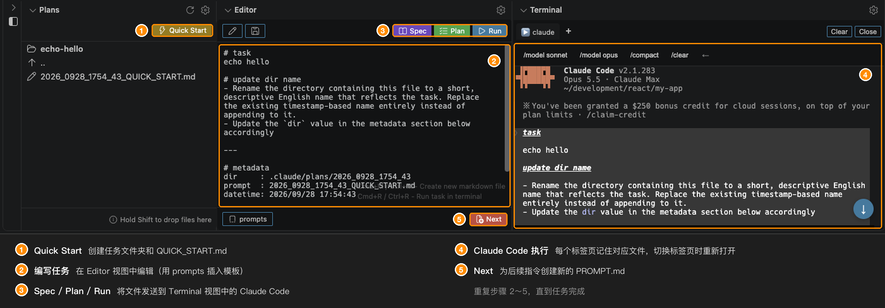

# AI Coding Panel for Claude Code

[](https://marketplace.visualstudio.com/items?itemName=nacn.ai-coding-sidebar) [](https://code.visualstudio.com/) [](https://marketplace.visualstudio.com/items?itemName=nacn.ai-coding-sidebar)

[English](README.md) | [日本語](README-JA.md) | [한국어](README-KO.md) | 简体中文 | [繁體中文](README-ZH-TW.md) | [Português (BR)](README-PT-BR.md)

一款功能强大的 VS Code 面板扩展，旨在最大限度地提升你使用 Claude Code 的效率。

在同一个集成面板中完成提示词文件管理、AI 命令执行和结果查看，简化 Claude Code 工作流。无需再在文件资源管理器、编辑器和终端之间来回切换。



## 为什么为 Claude Code 选择这款扩展？

本扩展专为提升 Claude Code 使用体验而打造：

- **无缝终端集成**：基于进程监控自动检测 Claude Code 会话（不依赖提示符模式）
- **智能上下文管理**：切换标签页时，自动在 Terminal、Editor 和 Plans 视图之间同步文件上下文
- **智能命令快捷方式**：根据 Claude Code 处于运行中还是空闲状态自动切换的上下文感知按钮
- **动态标签页名称**：像 iTerm2 一样显示正在运行的进程，并附带命令类型图标（▶️ Run、📝 Plan、📑 Spec）
- **持久会话**：切换视图后终端会话依然保留，不会丢失上下文或历史记录

## 功能

| 功能 | 说明 |
| --- | --- |
| **Plans** | 以带目录导航的平铺列表浏览和管理提示词文件 |
| **Editor** | 通过 Run/Plan/Spec 按钮执行 Claude Code 的命令中心 |
| **Terminal** | 针对 Claude Code 优化的终端，支持自动检测、上下文感知快捷方式和持久会话 |
| **Menu** | 快速访问设置、文档以及模板自定义（按工作区或全局） |

## 功能详情

### Plans

以带目录导航的平铺列表浏览和管理文件。

| 功能 | 说明 |
| --- | --- |
| 平铺列表显示 | 仅显示当前目录的内容（非树形结构） |
| 目录导航 | 点击目录即可进入该目录。使用 ".." 返回上级目录 |
| 自动选择文件 | 进入子目录时，自动选择并显示最早的 TASK.md、PROMPT.md、SPEC.md 或 QUICK_START.md 文件。返回根目录时不选择任何文件，使根目录保持为单纯的任务列表 |
| **创建目录并生成提示词文件** | "Create directory" 按钮会自动创建 `.claude/plans` 以及一个初始提示词文件（`YYYY_MMDD_HHMM_SS_PROMPT.md`），其中包含 Run/Plan/Spec 按钮的使用说明。文件会自动在 Editor 视图中打开 |
| **Quick Start** | 视图顶部的 ⚡ Quick Start 按钮无需输入文件夹名称，即可创建以时间戳命名的目录（`YYYY_MMDD_HHMM_SS`）和 `QUICK_START.md` 文件。适合想立即开始编写任务的场景 |
| 路径显示 | 当前路径作为列表的第一项显示，并带有内联操作按钮（New PROMPT.md、New TASK.md、New SPEC.md、Copy、Rename、New Directory、Archive） |
| **日期/时间前缀** | 根目录中的目录名前会显示日期或时间：当天显示 `[HH:MM]`，其他日期显示 `[MM/DD]`（文件不显示前缀） |
| **Editor 目标文件图标** | 在 Editor 视图中打开的文件（TASK.md、PROMPT.md、SPEC.md、QUICK_START.md）显示 `edit` 图标，以便与普通 Markdown 文件区分 |
| 排序 | 默认按创建日期（升序）排序 |
| Drag & Drop | 在视图内或从外部拖动文件即可复制。从视图外部拖入时请按住 **Shift**：拖动过程中，除非按住 Shift，否则 VS Code 会禁用基于 webview 的视图上的指针事件。拖放到目录行上会复制到该目录，拖放到视图的其他位置则复制到当前显示的目录。不能拖放文件夹（仅限文件）。视图右下角会显示相应提示 |
| **内联操作提示** | 将鼠标悬停在行上的内联操作图标（Archive、New PROMPT.md、Rename...、Insert Path to Editor 等）上时，会显示该操作的名称 |
| **键盘导航** | 使用 ↑ / ↓ 移动选择，按 Enter 打开所选项 |
| 自动刷新 | 文件创建、修改或删除时自动更新（即使视图处于隐藏状态） |
| 设置图标 | 快速访问默认路径和排序设置 |

### Editor（Claude Code 命令中心）

直接在面板中编辑 Markdown 提示词文件并执行 Claude Code 命令。

| 功能 | 说明 |
| --- | --- |
| **Run/Plan/Spec 命令** | 使用预配置的命令执行 Claude Code：<br>- **Run**（`Cmd+R` / `Ctrl+R`）：`claude "Execute the instructions described in the file at ${filePath}"`<br>- **Plan**：`claude --permission-mode plan "Review ... create an implementation plan ..."`<br>- **Spec**：`claude --permission-mode plan "Review ... create specification documents ..."`<br>执行前自动保存，即使未打开文件也可使用 |
| **发送历史** | 按下 Spec / Plan / Run 时，会将发送日期和时间追加到所打开文件末尾的 `## sent history` 部分（例如 `- run : 2026/09/06 21:27:29`）。之后的发送会复用该部分，可通过 `editor.recordSendTimestamp` 关闭记录 |
| **Resume 命令** | 每次执行 Spec / Plan / Run 时都会使用生成的会话 ID 启动 Claude Code，并在时间戳旁记录对应的命令（例如 `- run : 2026/09/06 21:27:29 \| claude --resume 0f1d2c3b-...`），以便之后重新打开该会话。可通过 `editor.recordResumeCommand` 关闭 |
| **自动终端集成** | 命令会发送到 Terminal 视图，并自动关联文件与标签页，实现无缝工作流 |
| 自动显示 | 选择以时间戳命名的 Markdown 文件（格式：`YYYY_MMDD_HHMM_SS_PROMPT.md`、`..._TASK.md`、`..._SPEC.md` 或 `..._QUICK_START.md`）时自动打开。其他 Markdown 文件在标准编辑器中打开 |
| **两栏布局** | 视图分为上下两栏：上栏左侧为 Edit / Save，右侧为 Spec / Plan / Run；下栏左侧为 prompts 按钮，右侧为 Next 按钮 |
| Save 按钮 | 显示在上栏，存在未保存更改时会改变颜色。未打开文件时会创建新文件（保存到当前 Plans 目录） |
| **Next 按钮** | 位于视图底部专用栏中的红色 **Next** 按钮。创建一个带时间戳的新 `PROMPT.md` 并打开，同时将光标置于文本区域，方便立即开始输入。也可使用 `Cmd+M` / `Ctrl+M` |
| **prompts 按钮** | 位于下栏左端的 **prompts** 按钮。点击后会在按钮正上方打开模板菜单，所选模板会插入到光标位置（再次按下按钮、点击其他位置或按 `Escape` 可关闭菜单）。菜单标题中的 **+** 按钮用于新建模板：选择创建位置（Workspace 或 Global），输入名称后，文件会在该目录下创建并在 VS Code 编辑器中打开。工作区模板位于 `.vscode/ai-coding-panel/prompts/*.md`，适用于所有工作区的模板位于 `<globalTemplatesPath>/prompts/*.md`（每个模板一个文件）。两者会一起列出，全局模板标记为 `(global)`；两处都存在的同名文件以工作区为准。两处都没有 Markdown 文件时，使用扩展自带的模板。可以通过 `editor.disableWorkspacePromptTemplates` 或 `editor.disableGlobalPromptTemplates` 将任一来源从列表中排除。文件内容按原样插入，因此开头的 `# heading` 也会被插入——该标题仅用作菜单中的名称。`{{filename}}`、`{{filepath}}`、`{{dirpath}}`、`{{datetime}}` 和 `{{timestamp}}` 会被替换为所打开文件的对应值。同样的操作也可以从命令面板中以 **Insert Prompt Template** 执行，此时显示的是快速选择列表。在 Menu 视图的 Workspace 部分运行 **Customize Prompt Templates** 可将自带模板复制到工作区，运行 Global 部分中的同名项目则会将其复制到全局目录 |
| 按钮图标 | 所有按钮都使用 VS Code codicon（Spec：书本、Plan：清单、Run：播放、Next：新建文件、Edit：铅笔、Save：软盘、prompts：代码片段），与 Plans View 中的 Quick Start 按钮保持一致 |
| 可自定义命令 | 可在设置中配置 Run、Plan 和 Spec 命令，以适配你的工作流 |
| **可点击的 URL** | 文本中的 URL 会带下划线，点击后在默认浏览器中打开。右键点击 URL 可选择 **Open in Default Browser** 或 **Open in Integrated Browser**（VS Code 的 Simple Browser）。在其他位置右键点击会显示 VS Code 标准菜单 |
| 只读模式 | 当文件在 VSCode 编辑器中处于活动状态时，自动切换为只读模式 |
| 自动保存 | 切换文件、导航目录或关闭视图时自动保存 |
| 恢复编辑 | 从其他扩展返回时恢复正在编辑的文件 |
| 设置图标 | 快速访问命令设置 |
| 焦点指示 | 视图获得焦点时显示边框 |

### Terminal（针对 Claude Code 优化）

内置终端专为 Claude Code 打造，具备智能自动化和上下文感知能力。

| 功能 | 说明 |
| --- | --- |
| **Claude Code 自动检测** | 基于进程的检测（每 1.5 秒检查一次）可可靠识别 Claude Code 会话，不受提示符变化影响。Claude Code 启动/退出时自动切换 UI 和快捷方式 |
| **上下文感知快捷方式** | 根据状态变化的智能按钮：<br>- 未运行：`claude`、`claude -c`、`claude -r`、`claude --from-pr`（仅插入，不执行）、`↑`<br>- 按下 `↑` 后（更新命令）：`claude update`、`←`<br>- 运行中：`/model sonnet`、`/model opus`、`/compact`、`/clear`、`←`<br>可在 Claude Code 会话中快速切换模型和执行更新命令 |
| **Run 快捷键** | 在 Terminal 视图获得焦点时按 `Cmd+R` / `Ctrl+R`，即可执行 Editor 视图的 Run 命令。编辑器中未保存的更改会先被保存，且该按键不会传递给 shell |
| **命令类型图标** | 标签页名称显示表示命令来源的图标：<br>▶️ Run 按钮<br>📝 Plan 按钮<br>📑 Spec 按钮 |
| **动态进程名称** | 与 iTerm2 类似，标签页名称会自动更新为当前正在运行的进程 |
| **标签页与文件关联** | 从 Editor 视图发送的命令会将文件与终端标签页关联。切换标签页时会自动：<br>- 在 Editor 视图中打开关联的文件<br>- 在 Plans 视图中导航到该文件所在目录<br>- 在任务目录被重命名后继续跟踪 |
| **会话持久化** | 切换视图或扩展后，终端会话和输出历史依然保留——你的工作永不丢失 |
| 多标签页 | 最多可创建 5 个独立的终端标签页。点击 "+" 按钮添加新标签页，点击标签页进行切换。关闭按钮（× Close）位于快捷方式区域的右端 |
| 自动滚动 | 有新输出或视图大小改变时，保持滚动位置在底部（仅当原本已位于底部时） |
| 可点击的链接 | URL 在浏览器中打开，文件路径（例如 `./src/file.ts:123`）在编辑器中打开并跳转到对应行。因换行而被拆分为两行的 URL 会在打开前重新拼接 |
| URL 上下文菜单 | 右键点击 URL 可选择 **Open in Default Browser** 或 **Open in Integrated Browser**（VS Code 的 Simple Browser）。左键点击仍在默认浏览器中打开 |
| Unicode 支持 | 完整支持 CJK 字符，并能正确计算字符宽度 |
| 可配置 | 可自定义 shell 路径、字体大小、字体族、光标样式、光标闪烁和回滚行数 |
| WebView 标题栏 | 包含显示 shell 名称的标签栏、快捷方式按钮，以及针对当前标签页的 Clear 和 Kill 按钮 |
| 设置图标 | 在标题栏中快速访问终端设置 |
| 默认可见性 | 折叠（需要时展开） |
| 焦点指示 | 视图获得焦点时显示边框 |

### Menu

快速访问设置和文档。

| 功能 | 说明 |
| --- | --- |
| 设置 | 打开用户设置或全局设置 |
| 模板 | 按工作区或为所有工作区全局自定义模板 |
| 分区 | Global 和 Workspace 默认展开，打开视图即可看到其中的项目。Usage Guide 默认折叠 |

## 典型的 Claude Code 工作流

### 1. 创建任务
1. 点击 Plans 视图顶部的 ⚡ Quick Start 按钮，创建新的任务目录
2. 一个带时间戳的 QUICK_START.md 文件会在 Editor 视图中打开
3. 编写任务描述或需求

### 2. 使用 Claude Code 执行
1. 按 `Cmd+R` / `Ctrl+R` 使用 Claude Code 执行任务
2. Terminal 视图会自动激活并发送命令
3. Claude Code 开始处理你的请求

### 3. 监控进度
1. 在 Terminal 视图中查看 Claude Code 的输出
2. 标签页名称通过图标（▶️、📝、📑）显示进程状态
3. 切换视图时滚动位置会被保留

### 4. 查看结果
1. Claude Code 创建实施计划或规格文档
2. 文件会自动出现在 Plans 视图中
3. 点击文件即可在 Editor 视图中查看
4. 终端标签页会保持与任务文件的关联

### 5. 迭代
1. 在多个终端标签页之间切换，同时处理多个任务
2. 每个标签页都会记住其关联的文件和上下文
3. 切换标签页时 Plans/Editor 视图会自动同步

## 使用方法

### 键盘快捷键

| 快捷键 | 操作 |
| --- | --- |
| `Cmd+Shift+A` (macOS)<br>`Ctrl+Shift+A` (Windows/Linux) | 聚焦 AI Coding Panel |
| `Cmd+S` (macOS)<br>`Ctrl+S` (Windows/Linux) | New Task（面板获得焦点时） |
| `Cmd+M` (macOS)<br>`Ctrl+M` (Windows/Linux) | 新建 Markdown 文件（面板获得焦点时） |
| `Cmd+R` (macOS)<br>`Ctrl+R` (Windows/Linux) | 在 Editor 中执行任务（自动保存并向终端发送命令）。在 Terminal 视图获得焦点时也可使用 |

### 基本操作
1. 点击活动栏中的 "AI Coding Panel" 图标（或按 `Cmd+Shift+A` / `Ctrl+Shift+A`）。
2. 点击 Plans 顶部的 ⚡ Quick Start 按钮，创建包含 QUICK_START.md 文件的新任务目录。
3. 在 Editor 视图中编写任务描述或需求。
4. 按 `Cmd+R` / `Ctrl+R` 使用 Claude Code 执行任务。
5. 在 Terminal 视图中监控 Claude Code 的进度。
6. Claude Code 创建文件后，在 Plans 和 Editor 视图中查看结果。

## 模板功能

从 Plans 创建文件时，可以自动填入模板内容。这样能让用于 AI 编程的 Markdown 文件保持一致，并节省时间。

### 配置模板
1. 点击 Plans 窗格中的齿轮图标。
2. 选择 "Workspace Settings" -> "Customize template"。
3. 模板文件会在 `.vscode/ai-coding-panel/templates/` 中创建：
   - `task.md` - Start Task 使用的模板
   - `spec.md` - New Spec 使用的模板
   - `prompt.md` - New File（PROMPT.md）使用的模板
   - `quick_start.md` - Quick Start 使用的模板
4. 编辑并保存模板。

### 默认模板
每个模板末尾都有一个共同的 `metadata` 部分：

```markdown
# task


---

# metadata
dir     : {{dirpath}}
prompt  : {{filename}}
datetime: {{datetime}}
```

### 可用变量
模板中可以使用以下变量：

- `{{datetime}}`：创建日期和时间（例如 2026/09/06 21:46:07）
- `{{filename}}`：包含扩展名的文件名（例如 2025_1229_1430_25_PROMPT.md）
- `{{timestamp}}`：时间戳（例如 2025_1229_1430_25）
- `{{filepath}}`：相对于工作区根目录的文件路径（例如 .claude/plans/2025_1229_1430_25_PROMPT.md）
- `{{dirpath}}`：相对于工作区根目录的目录路径（例如 .claude/plans）

### 全局模板
模板也可以在所有工作区之间共享。在 Menu 视图的 Global 部分运行 **Customize Editor Templates**，即可在全局目录下创建相同的四个文件，并在那里进行编辑。随后全局目录会在新的 VS Code 窗口中打开，因为工作区之外的路径无法显示在当前窗口的 VS Code 资源管理器中。新窗口会以根目录打开，因此 `templates` 和 `prompts` 都在其中。

全局目录默认是本扩展的全局存储目录。在**用户**设置中设置 `aiCodingSidebar.globalTemplatesPath`，即可将其放到其他位置，例如 dotfiles 仓库。该目录必须包含用于文件模板的 `templates` 子目录和用于提示词模板的 `prompts` 子目录：

```
<globalTemplatesPath>
|-- templates/   task.md, spec.md, prompt.md, quick_start.md
`-- prompts/     prompt templates inserted from the Editor view
```

### 自带的提示词模板
扩展为 Editor 视图中的 **prompts** 按钮自带了以下代码片段：

| 文件 | 请求内容 |
|---|---|
| `add_test.md` | 覆盖正常路径、边界值和错误处理的测试 |
| `output_status.md` | 当前状态，以带时间戳的 Markdown 文件写入 `dir` 所示目录下 |
| `refactor.md` | 保持行为不变的重构 |
| `review.md` | 优先报告缺陷和缺失的错误处理的代码审查 |

仅当工作区和全局目录中都没有 Markdown 文件时，才会列出这些模板。Workspace 部分的 **Customize Prompt Templates** 和 Global 部分的同名项目会复制这些模板，且不会覆盖已有文件，因此更新扩展后，重新运行其中之一即可获取新加入的代码片段。

### 模板优先级
1. `.vscode/ai-coding-panel/templates/` 中的工作区模板（如果存在）
2. `<globalTemplatesPath>/templates/` 中的全局模板（如果存在）
3. 扩展内置模板

第 1 步和第 2 步可以分别通过 `editor.disableWorkspaceEditorTemplates` 和 `editor.disableGlobalEditorTemplates` 关闭，此时由下一步接管。第 3 步始终保留，因此文件创建不会失效。提示词模板同样可通过 `editor.disableWorkspacePromptTemplates` 和 `editor.disableGlobalPromptTemplates` 控制；两者都关闭时，会列出自带的代码片段。这些设置只影响读取内容——**Customize Editor Templates**、**Customize Prompt Templates** 和 **+** 按钮仍会在你所选的目录中创建文件。

### 模板示例
- 在 `overview` 部分记录给 AI 助手的提示词。
- 在 `tasks` 部分跟踪待办事项。
- 添加项目特有的部分。

## 文件操作

| 功能 | 说明 |
| --- | --- |
| 创建文件或文件夹 | 快速创建新文件和文件夹。 |
| 重命名 | 重命名文件和文件夹。重命名目录后会自动导航到重命名后的目录。 |
| 删除 | 删除文件和文件夹（移至回收站）。 |
| 复制 / 剪切 / 粘贴 | 执行标准的剪贴板操作。 |
| Drag & Drop | 在 Plans 视图内或从外部拖动文件即可复制。从视图外部拖入时请按住 **Shift**：拖动过程中，除非按住 Shift，否则 VS Code 会禁用基于 webview 的视图上的指针事件。拖放到目录行上会复制到该目录，拖放到视图的其他位置则复制到当前显示的目录。复制完成后显示成功消息。 |
| Archive | 归档任务目录和单个文件，保持工作区整洁。点击目录行或文件行上的归档图标（内联按钮），或右键点击并选择 "Archive"，即可将其移动到 `archived` 文件夹。位于非根目录时，路径显示标题中也会出现归档按钮——点击后会归档当前目录并返回根目录。归档当前在 Editor 视图中打开的文件时，编辑器内容会被清空。如果已存在同名条目，会自动添加时间戳以避免冲突（目录追加在名称末尾，文件插入在扩展名之前）。 |
| Checkout Branch | 右键点击目录，即可使用目录名检出 git 分支。分支不存在时会创建，已存在时则切换到该分支。 |
| Insert Path to Editor | 将相对路径插入 Editor 视图。点击文件行上的编辑图标，或右键点击并选择 "Insert Path to Editor"。支持多选。 |
| Insert Path to Terminal | 将相对路径插入 Terminal 视图。点击文件行上的终端图标，或右键点击并选择 "Insert Path to Terminal"。支持多选，路径之间以空格分隔。 |

## 其他功能

### 创建文件和文件夹

| 项目 | 步骤 |
| --- | --- |
| Quick Start | 点击 Plans View 顶部的 ⚡ Quick Start 按钮。<br>无需输入文件夹名称即可创建以时间戳命名的目录（`YYYY_MMDD_HHMM_SS`），并在其中生成 `QUICK_START.md` 文件。<br>该文件会在 Editor View 中打开，并在 Plans 中被选中。如果同名目录已存在，会追加数字后缀（`_2`、`_3`、...）。<br>如果 Plans 目录尚不存在（视图显示 `Create directory: ...`），会先像点击 `Create directory` 一样创建该目录，然后在其中创建 Quick Start 目录。 |
| New Task | 在面板获得焦点时按 `Cmd+S` / `Ctrl+S`。<br>在 Plans View 当前打开的目录下创建新目录，并自动生成带时间戳的 Markdown 文件。<br>该文件会在 Plans 中以 "editing" 标签被选中，并在 Editor View 中打开。<br>如果无法获取当前路径，则回退到默认路径。 |
| New Directory | 点击路径显示行中的文件夹图标。<br>在当前打开的目录下创建新目录（不创建 Markdown 文件）。 |
| Create PROMPT.md | 点击 Editor View 中的 **Next** 按钮、路径显示行中的文件图标，或按 `Cmd+M` / `Ctrl+M`。<br>会创建带时间戳的 Markdown 文件（例如 `2025_1229_1430_25_PROMPT.md`），并在 Editor View 中打开，光标位于文件开头。 |
| Create TASK.md | 点击路径显示行中的 TASK.md 图标。<br>会创建带时间戳的 TASK.md 文件并在 Editor View 中打开。 |
| Create SPEC.md | 点击路径显示行中的 SPEC.md 图标。<br>会创建带时间戳的 SPEC.md 文件并在 Editor View 中打开。 |

### 配置默认相对路径

| 方法 | 步骤 |
| --- | --- |
| Plans 设置（推荐） | 1. 点击 Plans 中的齿轮图标。<br>2. 设置视图会打开，并已预先筛选出 `aiCodingSidebar.plans.defaultRelativePath`。<br>3. 编辑默认相对路径（例如 `src`、`.claude/plans`、`docs/api`）。 |
| 工作区设置 | 1. 点击 Plans 中的齿轮图标。<br>2. 选择 "Workspace Settings"。<br>3. 选择以下选项之一：<br>&nbsp;&nbsp;- **Create/Edit settings.json**：生成或编辑工作区设置文件。<br>&nbsp;&nbsp;- **Configure .claude folder**：创建 `.claude/plans` 文件夹并应用设置。<br>&nbsp;&nbsp;- **Customize template**：编辑创建文件时使用的模板。 |
| 在扩展中直接设置 | 1. 点击 Plans 中的编辑图标。<br>2. 输入相对路径（例如 `src`、`.claude/plans`、`docs/api`）。<br>3. 选择是否将其保存到设置中。 |

#### 相对路径示例
- `src` -> `<project>/src`
- `docs/api` -> `<project>/docs/api`
- `.claude/plans` -> `<project>/.claude/plans`
- 空字符串 -> 工作区根目录

#### 配置的路径不存在时
如果默认相对路径不存在，Plans 会显示 "Create directory" 按钮。点击该按钮即可自动创建目录并显示其内容。

### 其他

| 功能 | 说明 |
| --- | --- |
| 复制相对路径 | 将相对于工作区的路径复制到剪贴板。 |
| Plans 设置 | 从 Plans 打开设置视图，直接编辑默认相对路径。 |
| 搜索 | 在整个工作区中搜索文件。 |

## 设置

| 设置 | 说明 | 类型 | 默认值 | 选项 / 示例 |
| --- | --- | --- | --- | --- |
| `plans.defaultRelativePath` | Plans 的默认相对路径 | string | `".claude/plans"` | `"src"`, `.claude/plans`, `"docs/api"` |
| `plans.sortBy` | Plans 中文件和目录的排序依据 | string | `"created"` | `"name"`（文件名）<br>`"created"`（创建日期）<br>`"modified"`（修改日期） |
| `plans.sortOrder` | Plans 中文件和目录的排序顺序 | string | `"ascending"` | `"ascending"`（升序）<br>`"descending"`（降序） |
| `editor.commandPrefix` | 替换下列命令模板中 `${commandPrefix}` 的命令前缀 | string | `"claude"` | `"claude"`, `"claude --permission-mode auto"`, `"claude --model opus"` |
| `editor.runCommand` | 在 Editor 视图中点击 Run 按钮时执行的命令模板 | string | `claude "${editorContent}"` | 使用 `${editorContent}` 作为编辑器内容的占位符，使用 `${filePath}` 作为文件路径的占位符。请用双引号包裹占位符，使其值作为单个参数传递。 |
| `editor.runCommandWithoutFile` | 未打开文件时点击 Run 按钮执行的命令模板 | string | `claude "${editorContent}"` | 使用 `${editorContent}` 作为编辑器内容的占位符。请用双引号包裹占位符，使其值作为单个参数传递。 |
| `editor.runPlanCommand` | 点击 Plan 按钮时执行的命令模板 | string | `claude --permission-mode plan "Review the file at ${filePath} and create an implementation plan. Save it as a timestamped file (format: YYYY_MMDD_HHMM_SS_plan.md) in the same directory as ${filePath}."` | 使用 `${filePath}` 作为文件路径的占位符。请用双引号包裹占位符，使其值作为单个参数传递。 |
| `editor.runSpecCommand` | 点击 Spec 按钮时执行的命令模板 | string | `claude --permission-mode plan "Review the file at ${filePath} and create specification documents. Save them as timestamped files (format: YYYY_MMDD_HHMM_SS_requirements.md, YYYY_MMDD_HHMM_SS_design.md, YYYY_MMDD_HHMM_SS_plans.md) in the same directory as ${filePath}."` | 使用 `${filePath}` 作为文件路径的占位符。请用双引号包裹占位符，使其值作为单个参数传递。 |
| `editor.recordSendTimestamp` | 按下 Spec / Plan / Run 时，将发送日期和时间追加到所打开的文件中 | boolean | `true` | 历史记录会添加到文件末尾的 `## sent history` 部分 |
| `editor.recordResumeCommand` | 使用生成的会话 ID 启动 Spec / Plan / Run，并记录对应的 `claude --resume <session-id>` 命令 | boolean | `true` | 需要启用 `editor.recordSendTimestamp`。Claude Code 已在运行时，或 `editor.commandPrefix` 不是 `claude`、已指定会话时，会跳过 |
| `editor.promptTemplatesPath` | 存放从 Editor 视图插入的提示词模板的目录（相对于工作区根目录） | string | `".vscode/ai-coding-panel/prompts"` | 其下直接存放的每个 `.md` 文件对应一个模板。其中没有 Markdown 文件时，使用扩展自带的模板 |
| `editor.disableWorkspaceEditorTemplates` | 不加载工作区中的文件模板 | boolean | `false` | 改为依次使用全局模板和自带模板 |
| `editor.disableGlobalEditorTemplates` | 不加载全局目录中的文件模板 | boolean | `false` | 自带模板始终作为最后的回退保留，因此文件创建不会失效 |
| `editor.disableWorkspacePromptTemplates` | 不列出工作区中的提示词模板 | boolean | `false` | 被工作区同名模板遮盖的全局模板会变为可见 |
| `editor.disableGlobalPromptTemplates` | 不列出全局目录中的提示词模板 | boolean | `false` | 两个来源都禁用时，会列出自带的代码片段 |
| `globalTemplatesPath` | 存放在所有工作区之间共享的模板的目录（包含 `templates` 和 `prompts` 子目录）。为空时使用本扩展的全局存储目录。相对路径以主目录为基准解析，并会展开 `~`。请在**用户**设置中设置 | string | `""` | `"~/ai-coding-guide/ai-coding-panel"` 可将模板保存在 dotfiles 仓库中 |
| `browser.defaultUrl` | Menu 视图中 Open Integrated Browser 操作打开的 URL | string | `"about:blank"` | `"about:blank"` 打开空白标签页；设置为 `"http://localhost:3000"` 等 URL 则总是打开该地址 |
| `terminal.shell` | Terminal 视图使用的 shell 可执行文件路径 | string | `""` | 留空则使用系统默认 shell |
| `terminal.fontSize` | Terminal 视图的字体大小 | number | `12` | 任意正数 |
| `terminal.fontFamily` | Terminal 视图的字体族 | string | `"monospace"` | 任意有效的字体族 |
| `terminal.cursorStyle` | Terminal 视图的光标样式 | string | `"block"` | `"block"`, `"underline"`, `"bar"` |
| `terminal.cursorBlink` | 在 Terminal 视图中启用光标闪烁 | boolean | `true` | `true` 或 `false` |
| `terminal.scrollback` | Terminal 视图的回滚行数 | number | `1000` | 任意正数 |

### 配置示例

将以下内容添加到 `.vscode/settings.json`：

```json
{
  "aiCodingSidebar.plans.defaultRelativePath": ".claude/plans",
  "aiCodingSidebar.plans.sortBy": "created",
  "aiCodingSidebar.plans.sortOrder": "ascending",
  "aiCodingSidebar.editor.commandPrefix": "claude",
  "aiCodingSidebar.editor.runCommand": "${commandPrefix} \"${editorContent}\"",
  "aiCodingSidebar.editor.runCommandWithoutFile": "${commandPrefix} \"${editorContent}\"",
  "aiCodingSidebar.editor.runPlanCommand": "${commandPrefix} \"Review the file at ${filePath} and create an implementation plan. Save it as a timestamped file (format: YYYY_MMDD_HHMM_SS_plan.md) in the same directory as ${filePath}.\"",
  "aiCodingSidebar.editor.runSpecCommand": "${commandPrefix} \"Review the file at ${filePath} and create specification documents. Save them as timestamped files (format: YYYY_MMDD_HHMM_SS_requirements.md, YYYY_MMDD_HHMM_SS_design.md, YYYY_MMDD_HHMM_SS_tasks.md) in the same directory as ${filePath}.\"",
  "aiCodingSidebar.terminal.fontSize": 12,
  "aiCodingSidebar.terminal.cursorStyle": "block"
}
```

## 开发与构建

```bash
# Install dependencies
npm install

# Compile TypeScript
npm run compile

# Recompile automatically during development
npm run watch
```

## 调试

### 准备
1. 安装依赖：`npm install`
2. 编译 TypeScript：`npm run compile`

### 开始调试

#### 通过命令面板（推荐）
1. 按 `Ctrl+Shift+P`（Windows/Linux）或 `Cmd+Shift+P`（Mac）打开命令面板。
2. 输入并选择 "Debug: Start Debugging"。
3. 按 Enter 启动。

#### 其他启动方式
- **F5**：立即开始调试。
- **运行和调试视图**：打开侧边栏中的运行和调试图标，选择 "Run Extension"，然后点击绿色的播放按钮。
- **菜单栏**：选择 "Run" -> "Start Debugging"。

### 调试期间
- 会打开一个新的 VS Code 窗口（Extension Development Host）。
- 活动栏中会显示 "AI Coding Panel" 图标。
- 可以设置断点、检查变量并单步执行代码。
- 按 `Ctrl+R` / `Cmd+R` 重新加载扩展。

## 安装

### 使用 Claude Code 快速上手

1. 从 [VS Marketplace](https://marketplace.visualstudio.com/items?itemName=nacn.ai-coding-sidebar) 安装本扩展
2. 安装 [Claude Code CLI](https://docs.anthropic.com/claude/docs/claude-code)
3. 按 `Cmd+Shift+A` / `Ctrl+Shift+A` 打开 AI Coding Panel
4. 在 Plans 视图中创建任务（点击火箭图标 🚀）
5. 按 `Cmd+R` / `Ctrl+R` 启动 Claude Code

### 方法 1：开发模式（用于测试）
1. 克隆或下载本仓库。
2. 在 VS Code 中打开。
3. 按 `F5` 启动 Extension Development Host 窗口。
4. 在新的 VS Code 实例中测试扩展。

### 方法 2：通过 VSIX 包安装

#### 推荐：使用 GitHub 上的最新版本
1. 从 [GitHub Releases 页面](https://github.com/NaokiIshimura/vscode-panel/releases)下载最新的 VSIX 文件。
2. 通过命令行安装：
   ```bash
   code --install-extension ai-coding-sidebar-1.2.7.vsix
   ```
3. 重启 VS Code。

#### 使用本地构建
```bash
# Install directly from the releases directory
code --install-extension releases/ai-coding-sidebar-1.2.7.vsix
```

#### 自行构建包
1. 安装 VSCE 工具：
   ```bash
   npm install -g @vscode/vsce
   ```
2. 创建 VSIX 包：
   ```bash
   npm run package
   ```
3. 安装生成的 VSIX 文件：
   ```bash
   code --install-extension releases/ai-coding-sidebar-1.2.7.vsix
   ```
4. 重启 VS Code。

## 自动构建与发布

本项目使用 GitHub Actions 构建和发布扩展。

### 自动构建的工作方式
- **触发条件**：推送到 `master` 分支。
- **构建步骤**：
  1. 编译 TypeScript。
  2. 自动创建 VSIX 包。
  3. 将包上传到 GitHub Releases。
  4. 更新仓库中的 `releases/` 目录。

### 版本管理
发布标签根据 `package.json` 中的 `version` 字段创建。

```bash
# Bump versions
npm run version:patch   # 0.0.1 -> 0.0.2
npm run version:minor   # 0.0.1 -> 0.1.0
npm run version:major   # 0.0.1 -> 1.0.0
```

## 卸载

### 通过命令行
```bash
code --uninstall-extension ai-coding-sidebar
```

### 在 VS Code 中
1. 打开扩展视图（`Ctrl+Shift+X` / `Cmd+Shift+X`）。
2. 搜索 "AI Coding Panel"。
3. 点击 "Uninstall"。

## 系统要求

- VS Code 1.74.0 或更高版本
- Node.js（仅开发时需要）

## 兼容性说明

本扩展针对 Claude Code 进行了优化，但也可与 Cursor、GitHub Copilot 等其他 AI 编程助手配合使用。不过，部分功能（如 Claude Code 自动检测和上下文感知快捷方式）是专为 Claude Code 设计的，在其他工具中可能无法正常工作。
