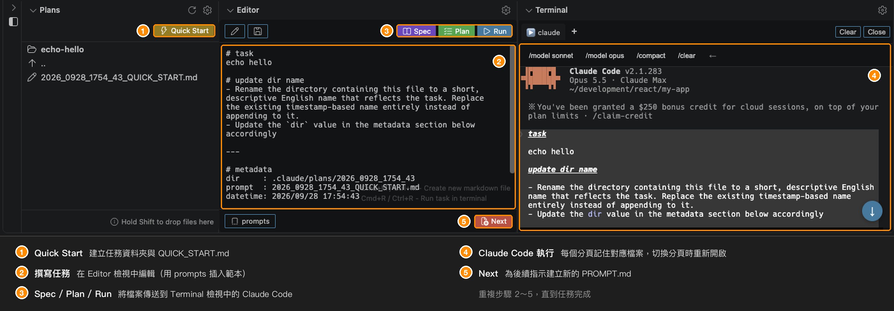

# AI Coding Panel for Claude Code

[](https://marketplace.visualstudio.com/items?itemName=nacn.ai-coding-sidebar) [](https://code.visualstudio.com/) [](https://marketplace.visualstudio.com/items?itemName=nacn.ai-coding-sidebar)

[English](README.md) | [日本語](README-JA.md) | [한국어](README-KO.md) | [简体中文](README-ZH-CN.md) | 繁體中文 | [Português (BR)](README-PT-BR.md)

一款強大的 VS Code 面板擴充功能，專為最大化 Claude Code 的生產力而設計。

在單一整合面板中管理提示詞檔案、執行 AI 指令並檢視結果，讓 Claude Code 的工作流程更加順暢。不必再於檔案總管、編輯器與終端機之間來回切換。



## 為什麼要為 Claude Code 使用這個擴充功能？

本擴充功能專為提升 Claude Code 的使用體驗而打造：

- **無縫的終端機整合**：透過以處理程序為基礎的監控自動偵測 Claude Code 工作階段（不依賴提示字元的模式）
- **智慧的上下文管理**：切換分頁時，自動在 Terminal、Editor 與 Plans 檢視之間同步檔案上下文
- **智慧指令捷徑**：依 Claude Code 是否正在執行而自動切換的情境感知按鈕
- **動態分頁名稱**：像 iTerm2 一樣顯示正在執行的處理程序，並附上指令類型圖示（▶️ Run、📝 Plan、📑 Spec）
- **持續保留的工作階段**：切換檢視時終端機工作階段仍會保留，不會遺失上下文或歷程記錄

## 功能

| 功能 | 說明 |
| --- | --- |
| **Plans** | 以平面清單檢視瀏覽與管理提示詞檔案，並可在目錄間導覽 |
| **Editor** | 透過 Run/Plan/Spec 按鈕執行 Claude Code 的指令中心 |
| **Terminal** | 為 Claude Code 最佳化的終端機，具備自動偵測、情境感知捷徑與持續保留的工作階段 |
| **Menu** | 快速存取設定、文件與範本自訂（可依工作區或全域設定） |

## 功能詳細說明

### Plans

以平面清單檢視瀏覽與管理檔案，並可在目錄間導覽。

| 功能 | 說明 |
| --- | --- |
| 平面清單顯示 | 僅顯示目前目錄的內容（非樹狀結構） |
| 目錄導覽 | 點擊目錄即可進入該目錄。使用「..」回到上層目錄 |
| 自動選取檔案 | 進入子目錄時，會自動選取並顯示最舊的 TASK.md、PROMPT.md、SPEC.md 或 QUICK_START.md 檔案。回到根目錄時不會選取任何檔案，讓根目錄維持為單純的任務清單 |
| **建立目錄並產生提示詞檔案** | 「Create directory」按鈕會自動建立 `.claude/plans` 以及初始提示詞檔案（`YYYY_MMDD_HHMM_SS_PROMPT.md`），其中包含 Run/Plan/Spec 按鈕的使用說明。檔案會自動在 Editor 檢視中開啟 |
| **Quick Start** | 檢視頂端的 ⚡ Quick Start 按鈕會建立以時間戳記命名的目錄（`YYYY_MMDD_HHMM_SS`）與 `QUICK_START.md` 檔案，不需要輸入資料夾名稱。適合想立即開始撰寫任務時使用 |
| 路徑顯示 | 目前路徑會顯示為清單中的第一個項目，並附有行內操作按鈕（New PROMPT.md、New TASK.md、New SPEC.md、Copy、Rename、New Directory、Archive） |
| **日期/時間前綴** | 根目錄中的目錄名稱前會顯示日期或時間：當天顯示 `[HH:MM]`，其他日期顯示 `[MM/DD]`（檔案不顯示前綴） |
| **Editor 目標檔案圖示** | 在 Editor 檢視中開啟的檔案（TASK.md、PROMPT.md、SPEC.md、QUICK_START.md）會顯示 `edit` 圖示，以便與一般 Markdown 檔案區分 |
| 排序 | 預設依建立日期（遞增）排序檔案 |
| 拖放 | 在檢視內或從外部來源拖曳檔案即可複製。從檢視外部拖入時請按住 **Shift**：除非按住 Shift，否則 VS Code 會在拖曳期間停用以 webview 為基礎之檢視的指標事件。放到目錄列上會複製到該目錄，放到檢視中的其他位置則會複製到目前顯示的目錄。無法拖放資料夾（僅限檔案）。檢視右下角會顯示提示 |
| **行內操作工具提示** | 將滑鼠移到列上的行內操作圖示（Archive、New PROMPT.md、Rename...、Insert Path to Editor 等）時，會顯示該操作的名稱 |
| **鍵盤導覽** | 使用 ↑ / ↓ 移動選取項目，按 Enter 開啟選取的項目 |
| 自動重新整理 | 檔案建立、修改或刪除時自動更新（即使檢視處於隱藏狀態） |
| 設定圖示 | 快速存取預設路徑與排序設定 |

### Editor（Claude Code 指令中心）

直接在面板中編輯 Markdown 提示詞檔案並執行 Claude Code 指令。

| 功能 | 說明 |
| --- | --- |
| **Run/Plan/Spec 指令** | 以預先設定的指令執行 Claude Code：<br>- **Run**（`Cmd+R` / `Ctrl+R`）：`claude "Execute the instructions described in the file at ${filePath}"`<br>- **Plan**：`claude --permission-mode plan "Review ... create an implementation plan ..."`<br>- **Spec**：`claude --permission-mode plan "Review ... create specification documents ..."`<br>執行前會自動儲存，即使未開啟檔案也能運作 |
| **傳送歷程記錄** | 按下 Spec / Plan / Run 時，會將傳送的日期與時間附加到開啟中檔案結尾的 `## sent history` 區段（例如 `- run : 2026/09/06 21:27:29`）。之後傳送時會沿用同一區段，也可以透過 `editor.recordSendTimestamp` 關閉記錄 |
| **Resume 指令** | 每次 Spec / Plan / Run 都會以產生的工作階段 ID 啟動 Claude Code，並在時間戳記旁記錄對應的指令（例如 `- run : 2026/09/06 21:27:29 \| claude --resume 0f1d2c3b-...`），方便日後重新開啟該工作階段。可透過 `editor.recordResumeCommand` 關閉 |
| **自動終端機整合** | 指令會傳送到 Terminal 檢視，並自動將檔案與分頁建立關聯，讓工作流程更順暢 |
| 自動顯示 | 選取以時間戳記命名的 Markdown 檔案（格式：`YYYY_MMDD_HHMM_SS_PROMPT.md`、`..._TASK.md`、`..._SPEC.md` 或 `..._QUICK_START.md`）時會自動開啟。其他 Markdown 檔案則以標準編輯器開啟 |
| **兩列版面配置** | 檢視分為兩列工具列：上方工具列左側為 Edit / Save，右側為 Spec / Plan / Run；下方工具列左側為 prompts 按鈕，右側為 Next 按鈕 |
| Save 按鈕 | 顯示於上方工具列，有未儲存的變更時會改變顏色。若未開啟任何檔案，則會建立新檔案（儲存到目前的 Plans 目錄） |
| **Next 按鈕** | 位於檢視底部專用工具列的紅色 **Next** 按鈕。會建立新的帶時間戳記 `PROMPT.md` 並開啟，同時將游標放在文字區域中，讓你可以立即開始輸入。也可以使用 `Cmd+M` / `Ctrl+M` |
| **prompts 按鈕** | 位於下方工具列左端的 **prompts** 按鈕。點擊後會在按鈕正上方開啟範本選單，選取的範本會插入到游標位置（再次按下按鈕、點擊其他位置或按下 `Escape` 即可關閉選單）。選單標題列中的 **+** 按鈕可建立新範本：選擇建立位置（Workspace 或 Global）並輸入名稱後，檔案會建立在該目錄下並於 VS Code 編輯器中開啟。範本存放於工作區的 `.vscode/ai-coding-panel/prompts/*.md`，以及適用於所有工作區的 `<globalTemplatesPath>/prompts/*.md`（每個範本一個檔案）。兩者會一起列出，全域範本會標示 `(global)`；兩處都存在的同名檔案會採用工作區的版本。兩處都沒有 Markdown 檔案時，會使用擴充功能內建的範本。可以透過 `editor.disableWorkspacePromptTemplates` 或 `editor.disableGlobalPromptTemplates` 將任一來源排除在清單之外。檔案內容會原封不動地插入，因此開頭的 `# heading` 也會一併插入——標題僅作為選單中的名稱使用。`{{filename}}`、`{{filepath}}`、`{{dirpath}}`、`{{datetime}}` 與 `{{timestamp}}` 會替換為開啟中檔案的值。同樣的操作也可以從命令選擇區以 **Insert Prompt Template** 執行，此時會改為顯示快速選取清單。從 Menu 檢視的 Workspace 區段執行 **Customize Prompt Templates** 可將內建範本複製到工作區，執行 Global 區段中的同名項目則會複製到全域目錄 |
| 按鈕圖示 | 每個按鈕都使用 VS Code codicon（Spec：書本、Plan：檢查清單、Run：播放、Next：新增檔案、Edit：鉛筆、Save：磁碟片、prompts：程式碼片段），與 Plans View 的 Quick Start 按鈕一致 |
| 可自訂的指令 | 可在設定中調整 Run、Plan 與 Spec 指令，以符合你的工作流程 |
| **可點擊的 URL** | 文字中的 URL 會加上底線，點擊即可在預設瀏覽器中開啟。在 URL 上按右鍵可選擇 **Open in Default Browser** 或 **Open in Integrated Browser**（VS Code 的 Simple Browser）。在其他位置按右鍵則會顯示 VS Code 標準選單 |
| 唯讀模式 | 當檔案在 VSCode 編輯器中處於作用中狀態時，會自動切換為唯讀模式 |
| 自動儲存 | 切換檔案、瀏覽目錄或關閉檢視時自動儲存 |
| 還原編輯 | 從其他擴充功能返回時，會還原正在編輯的檔案 |
| 設定圖示 | 快速存取指令設定 |
| 焦點指示 | 檢視取得焦點時會在周圍顯示框線 |

### Terminal（為 Claude Code 最佳化）

內嵌的終端機專為 Claude Code 打造，具備智慧自動化與情境感知能力。

| 功能 | 說明 |
| --- | --- |
| **Claude Code 自動偵測** | 以處理程序為基礎的偵測（每 1.5 秒檢查一次），不受提示字元變化影響，能可靠地辨識 Claude Code 工作階段。Claude Code 啟動或結束時會自動切換 UI 與捷徑 |
| **情境感知捷徑** | 依狀態變化的智慧按鈕：<br>- 未執行時：`claude`、`claude -c`、`claude -r`、`claude --from-pr`（僅插入，不執行）、`↑`<br>- 按下 `↑` 後（更新指令）：`claude update`、`←`<br>- 執行中：`/model sonnet`、`/model opus`、`/compact`、`/clear`、`←`<br>可在 Claude Code 工作階段中快速切換模型及執行更新指令 |
| **Run 快捷鍵** | 在 Terminal 檢視取得焦點時按下 `Cmd+R` / `Ctrl+R`，即可執行 Editor 檢視的 Run 指令。編輯器中未儲存的變更會先儲存，且該按鍵不會傳送到 shell |
| **指令類型圖示** | 分頁名稱會顯示表示指令來源的圖示：<br>▶️ Run 按鈕<br>📝 Plan 按鈕<br>📑 Spec 按鈕 |
| **動態處理程序名稱** | 像 iTerm2 一樣，分頁名稱會自動更新為目前正在執行的處理程序 |
| **分頁與檔案的關聯** | 從 Editor 檢視送出的指令會將檔案與終端機分頁建立關聯。切換分頁時會自動：<br>- 在 Editor 檢視中開啟關聯的檔案<br>- 在 Plans 檢視中移至該檔案所在的目錄<br>- 追蹤已重新命名的任務目錄 |
| **工作階段保留** | 切換檢視或變更擴充功能時，終端機工作階段與輸出歷程記錄都會保留——你的工作絕不會遺失 |
| 多個分頁 | 最多可建立 5 個獨立的終端機分頁。點擊「+」按鈕新增分頁，點擊分頁即可切換。關閉按鈕（× Close）位於捷徑區域的右端 |
| 自動捲動 | 有新輸出或調整檢視大小時，維持捲動位置在最底部（僅限原本已在最底部時） |
| 可點擊的連結 | URL 會在瀏覽器中開啟，檔案路徑（例如 `./src/file.ts:123`）會在編輯器中開啟並跳至指定行。因換行而被拆成兩行的 URL 會在開啟前重新接合 |
| URL 右鍵選單 | 在 URL 上按右鍵可選擇 **Open in Default Browser** 或 **Open in Integrated Browser**（VS Code 的 Simple Browser）。左鍵點擊仍會在預設瀏覽器中開啟 |
| Unicode 支援 | 完整支援 CJK 字元，並正確計算字元寬度 |
| 可設定 | 可自訂 shell 路徑、字型大小、字型家族、游標樣式、游標閃爍與捲動緩衝行數 |
| WebView 標題列 | 包含顯示 shell 名稱的分頁列、捷徑按鈕，以及作用中分頁的 Clear 與 Kill 按鈕 |
| 設定圖示 | 從標題列快速存取終端機設定 |
| 預設顯示狀態 | 摺疊（需要時再展開） |
| 焦點指示 | 檢視取得焦點時會在周圍顯示框線 |

### Menu

快速存取設定與文件。

| 功能 | 說明 |
| --- | --- |
| 設定 | 開啟使用者或全域設定 |
| 範本 | 依工作區自訂範本，或為所有工作區進行全域自訂 |
| 區段 | Global 與 Workspace 預設為展開，開啟檢視後即可看到其中的項目。Usage Guide 預設為摺疊 |

## 典型的 Claude Code 工作流程

### 1. 建立任務
1. 點擊 Plans 檢視頂端的 ⚡ Quick Start 按鈕，建立新的任務目錄
2. 帶時間戳記的 QUICK_START.md 檔案會在 Editor 檢視中開啟
3. 撰寫任務說明或需求

### 2. 使用 Claude Code 執行
1. 按下 `Cmd+R` / `Ctrl+R`，使用 Claude Code 執行任務
2. Terminal 檢視會自動啟用並送出指令
3. Claude Code 開始處理你的請求

### 3. 監控進度
1. 在 Terminal 檢視中查看 Claude Code 的輸出
2. 分頁名稱會以圖示（▶️、📝、📑）顯示處理程序狀態
3. 切換檢視時會保留捲動位置

### 4. 檢閱結果
1. Claude Code 會建立實作計畫或規格文件
2. 檔案會自動出現在 Plans 檢視中
3. 點擊檔案即可在 Editor 檢視中檢閱
4. 終端機分頁會持續保留與任務檔案的關聯

### 5. 反覆進行
1. 切換終端機分頁以同時處理多個任務
2. 每個分頁都會記住其關聯的檔案與上下文
3. 切換分頁時，Plans/Editor 檢視會自動同步

## 使用方式

### 鍵盤快捷鍵

| 快捷鍵 | 動作 |
| --- | --- |
| `Cmd+Shift+A`（macOS）<br>`Ctrl+Shift+A`（Windows/Linux） | 將焦點移至 AI Coding Panel |
| `Cmd+S`（macOS）<br>`Ctrl+S`（Windows/Linux） | New Task（面板取得焦點時） |
| `Cmd+M`（macOS）<br>`Ctrl+M`（Windows/Linux） | 建立新的 Markdown 檔案（面板取得焦點時） |
| `Cmd+R`（macOS）<br>`Ctrl+R`（Windows/Linux） | 在 Editor 中執行任務（自動儲存並將指令傳送到終端機）。在 Terminal 檢視取得焦點時也可使用 |

### 基本操作
1. 點擊活動列中的「AI Coding Panel」圖示（或按下 `Cmd+Shift+A` / `Ctrl+Shift+A`）。
2. 點擊 Plans 頂端的 ⚡ Quick Start 按鈕，建立含有 QUICK_START.md 檔案的新任務目錄。
3. 在 Editor 檢視中撰寫任務說明或需求。
4. 按下 `Cmd+R` / `Ctrl+R`，使用 Claude Code 執行任務。
5. 在 Terminal 檢視中監控 Claude Code 的進度。
6. Claude Code 建立檔案後，在 Plans 與 Editor 檢視中檢閱結果。

## 範本功能

從 Plans 建立檔案時，可以自動套用範本內容。這能讓用於 AI 程式開發的 Markdown 檔案保持一致，並節省時間。

### 設定範本
1. 點擊 Plans 窗格中的齒輪圖示。
2. 選擇「Workspace Settings」->「Customize template」。
3. 範本檔案會建立在 `.vscode/ai-coding-panel/templates/`：
   - `task.md` - Start Task 用的範本
   - `spec.md` - New Spec 用的範本
   - `prompt.md` - New File（PROMPT.md）用的範本
   - `quick_start.md` - Quick Start 用的範本
4. 編輯範本並儲存。

### 預設範本
每個範本的結尾都有共用的 `metadata` 區段：

```markdown
# task


---

# metadata
dir     : {{dirpath}}
prompt  : {{filename}}
datetime: {{datetime}}
```

### 可用的變數
範本中可以使用下列變數：

- `{{datetime}}`：建立日期與時間（例如 2026/09/06 21:46:07）
- `{{filename}}`：包含副檔名的檔案名稱（例如 2025_1229_1430_25_PROMPT.md）
- `{{timestamp}}`：時間戳記（例如 2025_1229_1430_25）
- `{{filepath}}`：相對於工作區根目錄的檔案路徑（例如 .claude/plans/2025_1229_1430_25_PROMPT.md）
- `{{dirpath}}`：相對於工作區根目錄的目錄路徑（例如 .claude/plans）

### 全域範本
範本也可以在所有工作區之間共用。從 Menu 檢視的 Global 區段執行 **Customize Editor Templates**，即可在全域目錄下建立相同的四個檔案，並在該處進行編輯。接著全域目錄會在新的 VS Code 視窗中開啟，因為工作區以外的路徑無法顯示在目前視窗的 VS Code 檔案總管中。該視窗會開啟在根目錄，因此 `templates` 與 `prompts` 都位於其中。

全域目錄是本擴充功能的全域儲存目錄。若要將其放在其他位置（例如 dotfiles 儲存庫），請在 **User** 設定中設定 `aiCodingSidebar.globalTemplatesPath`。該目錄必須包含存放檔案範本的 `templates` 子目錄，以及存放提示詞範本的 `prompts` 子目錄：

```
<globalTemplatesPath>
|-- templates/   task.md, spec.md, prompt.md, quick_start.md
`-- prompts/     prompt templates inserted from the Editor view
```

### 內建的提示詞範本
本擴充功能為 Editor 檢視的 **prompts** 按鈕內建了下列程式碼片段：

| 檔案 | 要求的內容 |
|---|---|
| `add_test.md` | 涵蓋正常路徑、邊界值與錯誤處理的測試 |
| `output_status.md` | 目前的狀態，以帶時間戳記的 Markdown 檔案寫入 `dir` 所指的目錄下 |
| `refactor.md` | 維持行為不變的重構 |
| `review.md` | 優先回報錯誤與缺少的錯誤處理的程式碼審查 |

只有在工作區與全域目錄都沒有 Markdown 檔案時，才會列出這些範本。Workspace 區段中的 **Customize Prompt Templates** 以及 Global 區段中的同名項目會複製這些範本，且絕不會覆寫既有檔案。因此在更新後，請再次執行其中一項，以取得新加入內建範本的程式碼片段。

### 範本優先順序
1. `.vscode/ai-coding-panel/templates/` 中的工作區範本（若存在）
2. `<globalTemplatesPath>/templates/` 中的全域範本（若存在）
3. 擴充功能內建範本

第 1 與第 2 步可以分別透過 `editor.disableWorkspaceEditorTemplates` 與 `editor.disableGlobalEditorTemplates` 關閉，關閉後會由下一步接手。第 3 步一律保留，因此檔案建立永遠不會失敗。提示詞範本也同樣適用，可透過 `editor.disableWorkspacePromptTemplates` 與 `editor.disableGlobalPromptTemplates` 設定；兩者都關閉時，會列出內建的程式碼片段。這些設定只影響讀取的內容——**Customize Editor Templates**、**Customize Prompt Templates** 與 **+** 按鈕仍會在你選擇的目錄中建立檔案。

### 範本範例
- 在 `overview` 區段中記錄給 AI 助理的提示詞。
- 在 `tasks` 區段中追蹤待辦事項。
- 新增專案專屬的區段。

## 檔案操作

| 功能 | 說明 |
| --- | --- |
| 建立檔案或資料夾 | 快速建立新的檔案與資料夾。 |
| 重新命名 | 重新命名檔案與資料夾。重新命名目錄後，會自動移至重新命名後的目錄。 |
| 刪除 | 刪除檔案與資料夾（移至垃圾桶）。 |
| 複製 / 剪下 / 貼上 | 執行標準的剪貼簿操作。 |
| 拖放 | 在 Plans 檢視內或從外部來源拖曳檔案即可複製。從檢視外部拖入時請按住 **Shift**：除非按住 Shift，否則 VS Code 會在拖曳期間停用以 webview 為基礎之檢視的指標事件。放到目錄列上會複製到該目錄，放到檢視中的其他位置則會複製到目前顯示的目錄。複製完成後會顯示成功訊息。 |
| 封存 | 封存任務目錄與個別檔案，讓工作區保持整潔。點擊目錄或檔案列上的封存圖示（行內按鈕），或按右鍵並選擇「Archive」，即可將其移至 `archived` 資料夾。位於非根目錄時，路徑顯示標題列也會出現封存按鈕——點擊後會封存目前的目錄並返回根目錄。封存目前在 Editor 檢視中開啟的檔案時，編輯器內容會被清除。若已存在同名項目，會自動加上時間戳記以避免衝突（目錄會附加在名稱結尾，檔案則插入在副檔名之前）。 |
| Checkout Branch | 在目錄上按右鍵，即可使用目錄名稱簽出 git 分支。若分支不存在會建立分支，若已存在則切換至該分支。 |
| Insert Path to Editor | 將相對路徑插入 Editor 檢視。點擊檔案列上的編輯圖示，或按右鍵並選擇「Insert Path to Editor」。支援多重選取。 |
| Insert Path to Terminal | 將相對路徑插入 Terminal 檢視。點擊檔案列上的終端機圖示，或按右鍵並選擇「Insert Path to Terminal」。支援多重選取。路徑之間以空格分隔。 |

## 其他功能

### 建立檔案與資料夾

| 項目 | 步驟 |
| --- | --- |
| Quick Start | 點擊 Plans View 頂端的 ⚡ Quick Start 按鈕。<br>不需要輸入資料夾名稱，即可建立以時間戳記命名的目錄（`YYYY_MMDD_HHMM_SS`），並在其中產生 `QUICK_START.md` 檔案。<br>檔案會在 Editor View 中開啟，並在 Plans 中被選取。若已存在同名目錄，會附加數字後綴（`_2`、`_3`、...）。<br>若 Plans 目錄尚不存在（檢視中顯示 `Create directory: ...`），會先如同點擊 `Create directory` 一樣建立該目錄，再於其中建立 Quick Start 目錄。 |
| New Task | 在面板取得焦點時按下 `Cmd+S` / `Ctrl+S`。<br>在 Plans View 中目前開啟的目錄下建立新目錄，並自動產生帶時間戳記的 Markdown 檔案。<br>該檔案會以「editing」標籤在 Plans 中被選取，並在 Editor View 中開啟。<br>若無法取得目前的路徑，則會改用預設路徑。 |
| New Directory | 點擊路徑顯示列中的資料夾圖示。<br>在目前開啟的目錄下建立新目錄（不建立 Markdown 檔案）。 |
| 建立 PROMPT.md | 點擊 Editor View 中的 **Next** 按鈕、路徑顯示列中的檔案圖示，或按下 `Cmd+M` / `Ctrl+M`。<br>會建立帶時間戳記的 Markdown 檔案（例如 `2025_1229_1430_25_PROMPT.md`），並在 Editor View 中開啟，游標會放在檔案開頭。 |
| 建立 TASK.md | 點擊路徑顯示列中的 TASK.md 圖示。<br>會建立帶時間戳記的 TASK.md 檔案，並在 Editor View 中開啟。 |
| 建立 SPEC.md | 點擊路徑顯示列中的 SPEC.md 圖示。<br>會建立帶時間戳記的 SPEC.md 檔案，並在 Editor View 中開啟。 |

### 設定預設相對路徑

| 方法 | 步驟 |
| --- | --- |
| Plans 設定（建議） | 1. 點擊 Plans 中的齒輪圖示。<br>2. 設定檢視會開啟，並已預先篩選 `aiCodingSidebar.plans.defaultRelativePath`。<br>3. 編輯預設相對路徑（例如 `src`、`.claude/plans`、`docs/api`）。 |
| 工作區設定 | 1. 點擊 Plans 中的齒輪圖示。<br>2. 選擇「Workspace Settings」。<br>3. 選擇下列其中一項：<br>&nbsp;&nbsp;- **Create/Edit settings.json**：產生或編輯工作區設定檔。<br>&nbsp;&nbsp;- **Configure .claude folder**：建立 `.claude/plans` 資料夾並套用設定。<br>&nbsp;&nbsp;- **Customize template**：編輯建立檔案時使用的範本。 |
| 從擴充功能內直接設定 | 1. 點擊 Plans 中的編輯圖示。<br>2. 輸入相對路徑（例如 `src`、`.claude/plans`、`docs/api`）。<br>3. 選擇是否儲存到設定中。 |

#### 相對路徑範例
- `src` -> `<project>/src`
- `docs/api` -> `<project>/docs/api`
- `.claude/plans` -> `<project>/.claude/plans`
- 空字串 -> 工作區根目錄

#### 當設定的路徑不存在時
若預設相對路徑不存在，Plans 會顯示「Create directory」按鈕。點擊後會自動建立該目錄並顯示其內容。

### 其他

| 功能 | 說明 |
| --- | --- |
| 複製相對路徑 | 將相對於工作區的路徑複製到剪貼簿。 |
| Plans 設定 | 從 Plans 開啟設定檢視，直接編輯預設相對路徑。 |
| 搜尋 | 在整個工作區中搜尋檔案。 |

## 設定

| 設定 | 說明 | 類型 | 預設值 | 選項 / 範例 |
| --- | --- | --- | --- | --- |
| `plans.defaultRelativePath` | Plans 的預設相對路徑 | string | `".claude/plans"` | `"src"`、`.claude/plans`、`"docs/api"` |
| `plans.sortBy` | Plans 中檔案與目錄的排序依據 | string | `"created"` | `"name"`（檔案名稱）<br>`"created"`（建立日期）<br>`"modified"`（修改日期） |
| `plans.sortOrder` | Plans 中檔案與目錄的排序順序 | string | `"ascending"` | `"ascending"`（遞增）<br>`"descending"`（遞減） |
| `editor.commandPrefix` | 替換下列指令範本中 `${commandPrefix}` 的指令前綴 | string | `"claude"` | `"claude"`、`"claude --permission-mode auto"`、`"claude --model opus"` |
| `editor.runCommand` | 點擊 Editor 檢視中的 Run 按鈕時執行的指令範本 | string | `claude "${editorContent}"` | 使用 `${editorContent}` 作為編輯器內容的預留位置，`${filePath}` 作為檔案路徑的預留位置。請以雙引號括住預留位置，讓值以單一引數傳遞。 |
| `editor.runCommandWithoutFile` | 未開啟檔案時點擊 Run 按鈕所執行的指令範本 | string | `claude "${editorContent}"` | 使用 `${editorContent}` 作為編輯器內容的預留位置。請以雙引號括住預留位置，讓值以單一引數傳遞。 |
| `editor.runPlanCommand` | 點擊 Plan 按鈕時執行的指令範本 | string | `claude --permission-mode plan "Review the file at ${filePath} and create an implementation plan. Save it as a timestamped file (format: YYYY_MMDD_HHMM_SS_plan.md) in the same directory as ${filePath}."` | 使用 `${filePath}` 作為檔案路徑的預留位置。請以雙引號括住預留位置，讓值以單一引數傳遞。 |
| `editor.runSpecCommand` | 點擊 Spec 按鈕時執行的指令範本 | string | `claude --permission-mode plan "Review the file at ${filePath} and create specification documents. Save them as timestamped files (format: YYYY_MMDD_HHMM_SS_requirements.md, YYYY_MMDD_HHMM_SS_design.md, YYYY_MMDD_HHMM_SS_plans.md) in the same directory as ${filePath}."` | 使用 `${filePath}` 作為檔案路徑的預留位置。請以雙引號括住預留位置，讓值以單一引數傳遞。 |
| `editor.recordSendTimestamp` | 按下 Spec / Plan / Run 時，將傳送的日期與時間附加到開啟中的檔案 | boolean | `true` | 歷程記錄會加入到檔案結尾的 `## sent history` 區段 |
| `editor.recordResumeCommand` | 以產生的工作階段 ID 啟動 Spec / Plan / Run，並記錄對應的 `claude --resume <session-id>` 指令 | boolean | `true` | 需要啟用 `editor.recordSendTimestamp`。當 Claude Code 已在執行中，或 `editor.commandPrefix` 不是 `claude` 或已指定工作階段時，會略過此功能 |
| `editor.promptTemplatesPath` | 存放從 Editor 檢視插入之提示詞範本的目錄（相對於工作區根目錄） | string | `".vscode/ai-coding-panel/prompts"` | 其正下方的每個 `.md` 檔案都會成為一個範本。目錄中沒有 Markdown 檔案時，會使用擴充功能內建的範本 |
| `editor.disableWorkspaceEditorTemplates` | 不載入工作區中的檔案範本 | boolean | `false` | 改用全域範本，接著是內建範本 |
| `editor.disableGlobalEditorTemplates` | 不載入全域目錄中的檔案範本 | boolean | `false` | 內建範本一律保留作為最後的備援，因此檔案建立永遠不會失敗 |
| `editor.disableWorkspacePromptTemplates` | 不列出工作區中的提示詞範本 | boolean | `false` | 原本被同名工作區範本遮蔽的全域範本會變得可見 |
| `editor.disableGlobalPromptTemplates` | 不列出全域目錄中的提示詞範本 | boolean | `false` | 兩個來源都停用時，會列出內建的程式碼片段 |
| `globalTemplatesPath` | 存放所有工作區共用範本的目錄（包含 `templates` 與 `prompts` 子目錄）。留空時使用本擴充功能的全域儲存目錄。相對路徑會以家目錄為基準解析，且會展開 `~`。請在 **User** 設定中設定此項 | string | `""` | `"~/ai-coding-guide/ai-coding-panel"` 可將範本存放在 dotfiles 儲存庫中 |
| `browser.defaultUrl` | Menu 檢視中 Open Integrated Browser 動作所開啟的 URL | string | `"about:blank"` | `"about:blank"` 會開啟空白分頁；設定如 `"http://localhost:3000"` 的 URL 則每次都會開啟該網址 |
| `terminal.shell` | Terminal 檢視使用的 shell 執行檔路徑 | string | `""` | 留空則使用系統預設 shell |
| `terminal.fontSize` | Terminal 檢視的字型大小 | number | `12` | 任意正數 |
| `terminal.fontFamily` | Terminal 檢視的字型家族 | string | `"monospace"` | 任何有效的字型家族 |
| `terminal.cursorStyle` | Terminal 檢視的游標樣式 | string | `"block"` | `"block"`、`"underline"`、`"bar"` |
| `terminal.cursorBlink` | 在 Terminal 檢視中啟用游標閃爍 | boolean | `true` | `true` 或 `false` |
| `terminal.scrollback` | Terminal 檢視的捲動緩衝行數 | number | `1000` | 任意正數 |

### 設定範例

將下列內容加入 `.vscode/settings.json`：

```json
{
  "aiCodingSidebar.plans.defaultRelativePath": ".claude/plans",
  "aiCodingSidebar.plans.sortBy": "created",
  "aiCodingSidebar.plans.sortOrder": "ascending",
  "aiCodingSidebar.editor.commandPrefix": "claude",
  "aiCodingSidebar.editor.runCommand": "${commandPrefix} \"${editorContent}\"",
  "aiCodingSidebar.editor.runCommandWithoutFile": "${commandPrefix} \"${editorContent}\"",
  "aiCodingSidebar.editor.runPlanCommand": "${commandPrefix} \"Review the file at ${filePath} and create an implementation plan. Save it as a timestamped file (format: YYYY_MMDD_HHMM_SS_plan.md) in the same directory as ${filePath}.\"",
  "aiCodingSidebar.editor.runSpecCommand": "${commandPrefix} \"Review the file at ${filePath} and create specification documents. Save them as timestamped files (format: YYYY_MMDD_HHMM_SS_requirements.md, YYYY_MMDD_HHMM_SS_design.md, YYYY_MMDD_HHMM_SS_tasks.md) in the same directory as ${filePath}.\"",
  "aiCodingSidebar.terminal.fontSize": 12,
  "aiCodingSidebar.terminal.cursorStyle": "block"
}
```

## 開發與建置

```bash
# Install dependencies
npm install

# Compile TypeScript
npm run compile

# Recompile automatically during development
npm run watch
```

## 偵錯

### 準備
1. 安裝相依套件：`npm install`
2. 編譯 TypeScript：`npm run compile`

### 開始偵錯

#### 從命令選擇區（建議）
1. 按下 `Ctrl+Shift+P`（Windows/Linux）或 `Cmd+Shift+P`（Mac）開啟命令選擇區。
2. 輸入並選擇「Debug: Start Debugging」。
3. 按下 Enter 啟動。

#### 其他啟動方式
- **F5**：立即開始偵錯。
- **執行和偵錯檢視**：開啟側邊欄中的執行和偵錯圖示，選擇「Run Extension」，然後點擊綠色的播放按鈕。
- **選單列**：選擇「Run」->「Start Debugging」。

### 偵錯期間
- 會開啟新的 VS Code 視窗（Extension Development Host）。
- 活動列中會顯示「AI Coding Panel」圖示。
- 可設定中斷點、檢查變數並逐步執行程式碼。
- 按下 `Ctrl+R` / `Cmd+R` 重新載入擴充功能。

## 安裝

### 搭配 Claude Code 快速開始

1. 從 [VS Marketplace](https://marketplace.visualstudio.com/items?itemName=nacn.ai-coding-sidebar) 安裝本擴充功能
2. 安裝 [Claude Code CLI](https://docs.anthropic.com/claude/docs/claude-code)
3. 按下 `Cmd+Shift+A` / `Ctrl+Shift+A` 開啟 AI Coding Panel
4. 從 Plans 檢視建立任務（點擊火箭圖示 🚀）
5. 按下 `Cmd+R` / `Ctrl+R` 啟動 Claude Code

### 方法 1：開發模式（用於測試）
1. 複製（clone）或下載本儲存庫。
2. 在 VS Code 中開啟。
3. 按下 `F5` 啟動 Extension Development Host 視窗。
4. 在新的 VS Code 執行個體中測試擴充功能。

### 方法 2：從 VSIX 套件安裝

#### 建議：使用 GitHub 上的最新版本
1. 從 [GitHub Releases 頁面](https://github.com/NaokiIshimura/vscode-panel/releases) 下載最新的 VSIX 檔案。
2. 透過命令列安裝：
   ```bash
   code --install-extension ai-coding-sidebar-1.2.8.vsix
   ```
3. 重新啟動 VS Code。

#### 使用本機建置
```bash
# Install directly from the releases directory
code --install-extension releases/ai-coding-sidebar-1.2.8.vsix
```

#### 自行建置套件
1. 安裝 VSCE 工具：
   ```bash
   npm install -g @vscode/vsce
   ```
2. 建立 VSIX 套件：
   ```bash
   npm run package
   ```
3. 安裝產生的 VSIX 檔案：
   ```bash
   code --install-extension releases/ai-coding-sidebar-1.2.8.vsix
   ```
4. 重新啟動 VS Code。

## 自動建置與發行

本專案使用 GitHub Actions 建置與發行擴充功能。

### 自動建置的運作方式
- **觸發條件**：推送至 `master` 分支。
- **建置步驟**：
  1. 編譯 TypeScript。
  2. 自動建立 VSIX 套件。
  3. 將套件上傳至 GitHub Releases。
  4. 更新儲存庫中的 `releases/` 目錄。

### 版本管理
發行標籤會依據 `package.json` 中的 `version` 欄位建立。

```bash
# Bump versions
npm run version:patch   # 0.0.1 -> 0.0.2
npm run version:minor   # 0.0.1 -> 0.1.0
npm run version:major   # 0.0.1 -> 1.0.0
```

## 解除安裝

### 透過命令列
```bash
code --uninstall-extension ai-coding-sidebar
```

### 在 VS Code 中
1. 開啟擴充功能檢視（`Ctrl+Shift+X` / `Cmd+Shift+X`）。
2. 搜尋「AI Coding Panel」。
3. 點擊「Uninstall」。

## 系統需求

- VS Code 1.74.0 或更新版本
- Node.js（僅開發時需要）

## 相容性說明

雖然本擴充功能針對 Claude Code 進行了最佳化，但也能搭配 Cursor 與 GitHub Copilot 等其他 AI 程式開發助理使用。不過，部分功能（例如 Claude Code 自動偵測與情境感知捷徑）是專為 Claude Code 設計的，可能無法在其他工具中運作。
