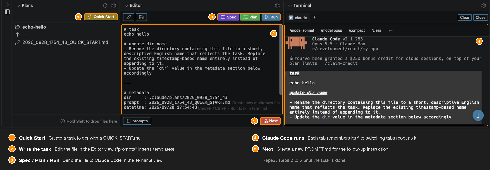

# Quick Start

Run a task with Claude Code in five steps.

| # | Step | What to do |
|---|------|------------|
| 1 | **Quick Start** | Click Quick Start in the Plans view to create a task folder with a `QUICK_START.md` |
| 2 | **Write the task** | Write what you want done in the Editor view (`prompts` inserts templates) |
| 3 | **Spec / Plan / Run** | Send the file to Claude Code in the Terminal view |
| 4 | **Claude Code runs** | Watch the output. Each tab remembers its file; switching tabs reopens it |
| 5 | **Next** | Create a new `PROMPT.md` for the follow-up instruction |

Repeat steps 2 to 5 until the task is done.

---

For detailed information on each view, see:
- [Plans View](plans-view.md)
- [Editor View](editor-view.md)
- [Terminal View](terminal-view.md)
- [Keyboard Shortcuts](keyboard-shortcuts.md)

For more information, visit the [GitHub repository](https://github.com/NaokiIshimura/vscode-ai-coding-sidebar).
